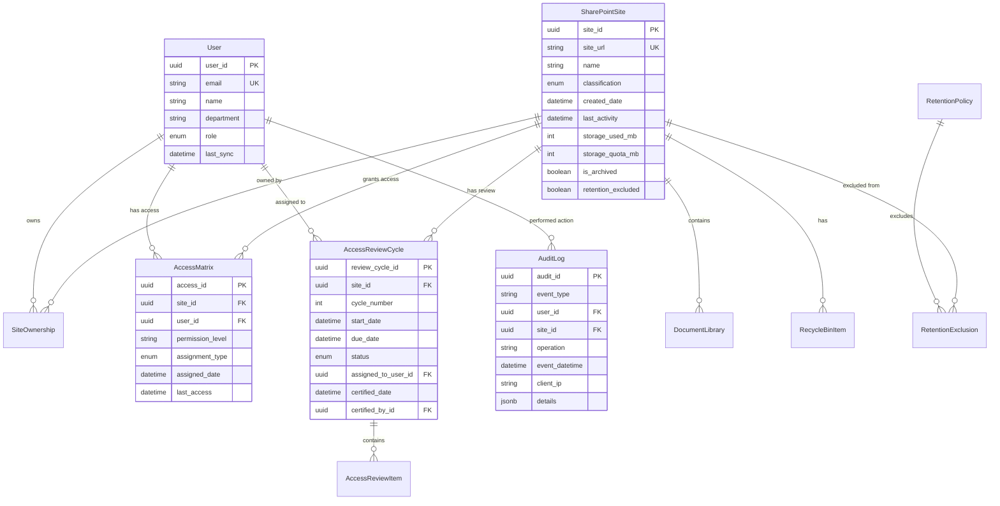

# Architecture Review: SharePoint Online Governance Platform

**Version**: 1.0  
**Date**: December 5, 2025  
**Reviewers**: System Architecture Team  
**Status**: Approved for Implementation

---

## Executive Summary

This document provides a comprehensive architecture review for the SharePoint Online Governance Platform. The platform adopts a **modern microservices-inspired layered architecture** with **Python/FastAPI backend**, **React frontend**, **PostgreSQL database**, and **Docker containerization**. The architecture is designed for **scalability** (300 → 1000+ users), **security** (AD/ADFS + RBAC), **maintainability** (clean separation of concerns), and **extensibility** (plugin-based integrations).

### Key Architectural Decisions
1. **Backend**: Python/FastAPI for async performance and excellent Microsoft ecosystem support
2. **Database**: PostgreSQL for ACID compliance, JSON support, and cost-effectiveness
3. **Frontend**: React with TypeScript for type safety and component reusability
4. **Deployment**: Docker Compose (dev/staging), Docker Swarm or Kubernetes (production)
5. **Authentication**: JWT-based with AD/LDAP integration for stateless scalability
6. **Integration**: Hybrid approach using PnP PowerShell + Microsoft Graph API

---

## 1. System Architecture Overview

### 1.1 High-Level Architecture

```
┌─────────────────────────────────────────────────────────────────┐
│                         CLIENT TIER                             │
│                                                                 │
│  ┌──────────────┐  ┌──────────────┐  ┌──────────────┐        │
│  │ Site Owner   │  │ Admin        │  │ Compliance   │        │
│  │ Dashboard    │  │ Dashboard    │  │ Dashboard    │        │
│  └──────────────┘  └──────────────┘  └──────────────┘        │
│          │                 │                 │                 │
│          └─────────────────┴─────────────────┘                 │
│                         │                                       │
│                    HTTPS/WSS                                    │
└─────────────────────────┼───────────────────────────────────────┘
                          │
┌─────────────────────────┼───────────────────────────────────────┐
│                    PRESENTATION LAYER                           │
│                                                                 │
│  ┌───────────────────────────────────────────────────────────┐ │
│  │              React SPA (TypeScript)                        │ │
│  │  ├─ Redux Store (State Management)                        │ │
│  │  ├─ React Router (Routing)                               │ │
│  │  ├─ Material-UI (Components)                             │ │
│  │  ├─ Axios (HTTP Client with interceptors)               │ │
│  │  └─ Service Workers (PWA, offline support)              │ │
│  └───────────────────────────────────────────────────────────┘ │
│                         │                                       │
│                    REST API                                     │
└─────────────────────────┼───────────────────────────────────────┘
                          │
┌─────────────────────────┼───────────────────────────────────────┐
│                   APPLICATION LAYER                             │
│                                                                 │
│  ┌───────────────────────────────────────────────────────────┐ │
│  │              FastAPI Application Server                    │ │
│  │  ├─ API Routes (versioned: /api/v1/*)                     │ │
│  │  ├─ Pydantic Schemas (validation)                         │ │
│  │  ├─ Dependency Injection (auth, DB sessions)              │ │
│  │  ├─ Middleware (CORS, logging, error handling)            │ │
│  │  └─ Background Tasks (async job queue)                    │ │
│  └───────────────────────────────────────────────────────────┘ │
│                         │                                       │
│  ┌───────────────────────────────────────────────────────────┐ │
│  │              Business Logic Layer                          │ │
│  │  ├─ Site Discovery Service                                │ │
│  │  ├─ Access Review Service                                 │ │
│  │  ├─ Audit Service                                         │ │
│  │  ├─ Retention Policy Service                              │ │
│  │  ├─ Version Tracking Service                              │ │
│  │  ├─ Anomaly Detection Service (ML)                        │ │
│  │  └─ Report Generation Service                             │ │
│  └───────────────────────────────────────────────────────────┘ │
│                         │                                       │
└─────────────────────────┼───────────────────────────────────────┘
                          │
┌─────────────────────────┼───────────────────────────────────────┐
│                   INTEGRATION LAYER                             │
│                                                                 │
│  ┌─────────────────┐  ┌─────────────────┐  ┌────────────────┐ │
│  │ SharePoint      │  │ Microsoft       │  │ Active         │ │
│  │ Client          │  │ Graph Client    │  │ Directory      │ │
│  │ (PnP + REST)    │  │ (SDK)           │  │ (LDAP)         │ │
│  └─────────────────┘  └─────────────────┘  └────────────────┘ │
│                         │                                       │
└─────────────────────────┼───────────────────────────────────────┘
                          │
┌─────────────────────────┼───────────────────────────────────────┐
│                   EXTERNAL SERVICES                             │
│                                                                 │
│  ┌──────────────────┐  ┌──────────────────┐                   │
│  │ SharePoint       │  │ Microsoft 365    │                   │
│  │ Online           │  │ (Graph, Purview) │                   │
│  │ (Tenant)         │  │                  │                   │
│  └──────────────────┘  └──────────────────┘                   │
└─────────────────────────────────────────────────────────────────┘
                          │
┌─────────────────────────┼───────────────────────────────────────┐
│                    DATA LAYER                                   │
│                                                                 │
│  ┌────────────────────────────────────┐                        │
│  │  PostgreSQL 15                     │                        │
│  │  ├─ Relational Tables              │                        │
│  │  ├─ Indexes (B-tree, GiST)         │                        │
│  │  ├─ Partitioning (audit logs)      │                        │
│  │  └─ Row-Level Security (RLS)       │                        │
│  └────────────────────────────────────┘                        │
│                                                                 │
│  ┌────────────────────────────────────┐                        │
│  │  Redis 7                           │                        │
│  │  ├─ Session Store                  │                        │
│  │  ├─ API Response Cache             │                        │
│  │  ├─ Rate Limiting                  │                        │
│  │  └─ Distributed Locks              │                        │
│  └────────────────────────────────────┘                        │
│                                                                 │
│  ┌────────────────────────────────────┐                        │
│  │  File Storage (Volume/NFS)         │                        │
│  │  ├─ Audit Log Exports              │                        │
│  │  ├─ PDF Reports                    │                        │
│  │  └─ ML Model Artifacts             │                        │
│  └────────────────────────────────────┘                        │
└─────────────────────────────────────────────────────────────────┘
```

### 1.2 Architectural Patterns

#### Layered Architecture
- **Presentation Layer**: React SPA, isolated from business logic
- **Application Layer**: FastAPI with thin controllers, delegates to services
- **Business Logic Layer**: Service classes with domain logic
- **Data Access Layer**: SQLAlchemy ORM abstracts database operations
- **Integration Layer**: Adapters for external services (SharePoint, Graph, AD)

**Benefits**:
- ✅ Clear separation of concerns
- ✅ Testable (mock dependencies)
- ✅ Maintainable (changes isolated to layers)
- ✅ Scalable (layers can be distributed)

#### Repository Pattern
- All database operations encapsulated in repository classes
- Example: `SiteRepository`, `AuditLogRepository`
- Services depend on repository interfaces, not concrete implementations

#### Dependency Injection
- FastAPI's built-in DI for database sessions, current user, settings
- Reduces coupling, improves testability

---

## 2. Technology Stack Evaluation

### 2.1 Backend: Python/FastAPI vs. Node.js/Express

#### Python/FastAPI (Selected)

**Pros**:
- ✅ **Async Performance**: FastAPI is built on Starlette (async framework), comparable to Node.js
- ✅ **Type Safety**: Pydantic models provide runtime type validation
- ✅ **Microsoft Ecosystem**: Excellent SDKs (msgraph, office365, python-ldap)
- ✅ **Data Processing**: Superior for ML/AI (scikit-learn, pandas) in Phase 3
- ✅ **Automatic Documentation**: OpenAPI/Swagger auto-generated
- ✅ **Developer Productivity**: Concise syntax, strong typing with type hints

**Cons**:
- ⚠️ GIL (Global Interpreter Lock) limits CPU-bound parallelism (mitigated by async I/O focus)
- ⚠️ Smaller ecosystem for real-time features compared to Node.js

#### Node.js/Express (Alternative)

**Pros**:
- ✅ JavaScript everywhere (same language as frontend)
- ✅ Mature ecosystem (npm packages)
- ✅ Excellent real-time support (Socket.io)

**Cons**:
- ❌ Weaker type system (even with TypeScript, no runtime validation)
- ❌ Less robust Microsoft Graph SDK compared to Python
- ❌ Callback hell (mitigated by async/await, but error handling is cumbersome)

**Decision: Python/FastAPI** ✅  
**Rationale**: Superior Microsoft integration, built-in validation, better for ML in Phase 3

---

### 2.2 Database: PostgreSQL vs. SQL Server

#### PostgreSQL 15 (Selected)

**Pros**:
- ✅ **Open Source**: No licensing costs
- ✅ **JSON Support**: Native JSONB for flexible schema (e.g., audit log details)
- ✅ **Advanced Features**: Partitioning, full-text search, row-level security
- ✅ **Cross-Platform**: Runs on Linux, Windows, macOS
- ✅ **Excellent Python Support**: psycopg2, asyncpg libraries

**Cons**:
- ⚠️ Less integrated with Microsoft ecosystem (no native AD integration)

#### SQL Server 2019+ (Alternative)

**Pros**:
- ✅ Enterprise-grade features (Transparent Data Encryption, Always On)
- ✅ Deep Microsoft integration (SSMS, SSIS, Power BI)
- ✅ Familiar to Windows admins

**Cons**:
- ❌ Licensing costs (significant for production)
- ❌ Heavier resource usage
- ❌ Less flexible on non-Windows platforms

**Decision: PostgreSQL 15** ✅  
**Rationale**: Cost-effective, modern features, aligns with open-source stack

---

### 2.3 Frontend: React vs. Vue.js

#### React 18 (Selected)

**Pros**:
- ✅ **Large Ecosystem**: More third-party libraries, larger talent pool
- ✅ **Corporate Adoption**: Widely used in enterprises (Meta, Netflix, Airbnb)
- ✅ **TypeScript Integration**: First-class TypeScript support
- ✅ **Material-UI**: Robust enterprise component library

**Cons**:
- ⚠️ Steeper learning curve (JSX, hooks)

#### Vue.js 3 (Alternative)

**Pros**:
- ✅ Easier learning curve
- ✅ Excellent documentation
- ✅ Composition API similar to React Hooks

**Cons**:
- ❌ Smaller ecosystem
- ❌ Less corporate adoption

**Decision: React 18** ✅  
**Rationale**: Better enterprise support, larger ecosystem, Material-UI availability

---

### 2.4 Deployment: Docker Swarm vs. Kubernetes

#### Docker Swarm (Recommended for Initial Deployment)

**Pros**:
- ✅ **Simplicity**: Easier to set up and manage than Kubernetes
- ✅ **Docker Native**: Works seamlessly with Docker Compose
- ✅ **Sufficient for 300-1000 users**

**Cons**:
- ⚠️ Less feature-rich (no advanced scheduling, less ecosystem)

#### Kubernetes (Future Scalability)

**Pros**:
- ✅ **Industry Standard**: Massive ecosystem (Helm, Operators, Istio)
- ✅ **Advanced Features**: Auto-scaling, rolling updates, self-healing
- ✅ **Multi-cloud Support**

**Cons**:
- ❌ Complex setup and management (requires dedicated DevOps)
- ❌ Overkill for <1000 users

**Decision: Docker Swarm initially, migrate to Kubernetes if scaling beyond 1000 users** ✅  
**Rationale**: Pragmatic, reduces initial complexity, allows future migration

---

## 3. Scalability Architecture

### 3.1 Horizontal Scaling Strategy

#### Application Tier
- **Stateless Backend**: FastAPI instances are stateless (no server-side sessions)
- **Load Balancer**: NGINX or cloud load balancer distributes traffic
- **Auto-Scaling**: Scale up/down based on CPU/memory utilization

**Scaling Formula**:
- Current: 1 backend instance handles ~100 concurrent users
- Target: 300 users → 3-4 instances (with load balancer)
- Future: 1000 users → 10-12 instances

#### Database Tier
- **Read Replicas**: PostgreSQL read replicas for reporting queries
- **Connection Pooling**: pgBouncer for connection reuse (500+ concurrent connections)
- **Partitioning**: Partition `audit_logs` table by month/quarter for performance

#### Cache Tier
- **Redis Cluster**: Shard cache across multiple Redis nodes
- **Cache Strategy**:
  - **Dashboard Metrics**: TTL 30 seconds (frequently updated)
  - **Permission Checks**: TTL 5 minutes (moderate update frequency)
  - **Site Metadata**: TTL 1 hour (infrequent changes)

### 3.2 Performance Optimization

#### Backend Optimizations
1. **Async I/O**: All SharePoint/Graph API calls are async (no blocking)
2. **Batch Operations**: Fetch multiple sites in single Graph API call
3. **Database Query Optimization**:
   - Indexes on: `site_id`, `user_id`, `event_datetime`, composite index `(site_id, user_id)`
   - Use `SELECT` only required fields (avoid `SELECT *`)
   - Eager loading of relationships (SQLAlchemy `joinedload`)

#### Frontend Optimizations
1. **Code Splitting**: Lazy load routes (React.lazy)
2. **Virtualization**: Virtualized tables for large datasets (react-window)
3. **Memoization**: React.memo for expensive components
4. **Debouncing**: Debounce search inputs (lodash.debounce)

#### Caching Strategy
| Data Type | Cache Layer | TTL | Invalidation |
|-----------|-------------|-----|--------------|
| Dashboard metrics | Redis | 30s | Time-based |
| Site metadata | Redis | 1 hour | Event-based (on update) |
| Access matrix | Redis | 5 min | Event-based (on permission change) |
| User profile | Redis | 30 min | Event-based (on AD sync) |
| Audit logs | PostgreSQL materialized view | N/A | Daily refresh |

---

## 4. Security Architecture

### 4.1 Authentication Flow

```
┌─────────┐                ┌─────────┐                ┌─────────┐
│ Client  │                │ Backend │                │   AD    │
└────┬────┘                └────┬────┘                └────┬────┘
     │                          │                          │
     │ 1. POST /auth/login      │                          │
     │   {username, password}   │                          │
     ├─────────────────────────>│                          │
     │                          │ 2. LDAP Bind             │
     │                          ├─────────────────────────>│
     │                          │                          │
     │                          │ 3. Auth Success + Groups │
     │                          │<─────────────────────────┤
     │                          │                          │
     │                          │ 4. Query DB for user     │
     │                          │    (sync if new)         │
     │                          │                          │
     │ 5. JWT Token             │                          │
     │   {user_id, role, exp}   │                          │
     │<─────────────────────────┤                          │
     │                          │                          │
     │ 6. Subsequent Requests   │                          │
     │   Authorization: Bearer  │                          │
     ├─────────────────────────>│                          │
     │                          │ 7. Validate JWT          │
     │                          │    (signature, expiry)   │
     │                          │                          │
     │ 8. Response              │                          │
     │<─────────────────────────┤                          │
     │                          │                          │
```

### 4.2 Authorization: Role-Based Access Control (RBAC)

#### Role Hierarchy
```
Executive (View Only)
    │
    ├─ Compliance Officer (Approve retention, view all audits)
    │       │
    │       └─ Auditor (Read-only access to audits)
    │
    └─ Admin (Full control: sites, users, policies)
            │
            └─ Site Owner (Manage owned sites, access reviews)
```

#### Permission Matrix

| Resource | Site Owner | Admin | Auditor | Compliance Officer | Executive |
|----------|------------|-------|---------|-------------------|-----------|
| View own sites | ✅ | ✅ | ❌ | ❌ | ❌ |
| View all sites | ❌ | ✅ | ✅ | ✅ | ✅ |
| Trigger site discovery | ❌ | ✅ | ❌ | ❌ | ❌ |
| View access reviews (own) | ✅ | ✅ | ❌ | ❌ | ❌ |
| View audit logs (own sites) | ✅ | ✅ | ✅ | ✅ | ✅ |
| View audit logs (all) | ❌ | ✅ | ✅ | ✅ | ✅ |
| Revoke access | ❌ | ✅ | ❌ | ❌ | ❌ |
| Retention policy changes | ❌ | Request | ❌ | Approve | ❌ |
| Admin actions | ❌ | ✅ | ❌ | ❌ | ❌ |

**Implementation**: Decorator pattern in FastAPI
```python
@router.get("/sites")
@require_role([Role.ADMIN, Role.SITE_OWNER])
async def list_sites(current_user: User = Depends(get_current_user)):
    if current_user.role == Role.SITE_OWNER:
        return filter_owned_sites(current_user.id)
    else:
        return get_all_sites()
```

### 4.3 Data Security

#### Encryption
- **In Transit**: TLS 1.3 (HTTPS) for all client-server communication
- **At Rest**: 
  - PostgreSQL: Encrypt sensitive fields (e.g., external user emails) using pgcrypto
  - Secrets: Store Microsoft 365 credentials in environment variables or secret manager (e.g., HashiCorp Vault)

#### Secrets Management
- **Development**: `.env` file (gitignored)
- **Production**: Environment variables injected via Docker secrets or Kubernetes secrets
- **Certificate-based Auth**: Use certificate-based authentication for service accounts (no passwords)

#### Audit Trail Security
- **Immutability**: Audit logs are insert-only (no UPDATE/DELETE)
- **Tamper Detection**: Optional cryptographic hashing of log entries
- **Access Logging**: Log all access to audit logs (who viewed what, when)

---

## 5. Integration Architecture

### 5.1 SharePoint Integration

#### Hybrid Approach: PnP PowerShell + REST API

**Why Hybrid?**
- **PnP PowerShell**: Best for complex operations (site provisioning, permission management) with rich cmdlet library
- **REST API (Python)**: Better for data retrieval (site lists, metadata) with programmatic control

**Integration Points**:
1. **Site Discovery**: Graph API (`/sites`) for initial discovery
2. **Permission Retrieval**: PnP PowerShell (`Get-PnPSiteCollectionAdmin`) for detailed permissions
3. **Access Revocation**: Graph API (`/sites/{id}/permissions/{id}`) for revoking access
4. **Version Cleanup**: PnP PowerShell (`Remove-PnPFileVersion`) for bulk version deletion

**PowerShell Gateway**:
- Backend exposes internal API endpoint `/internal/powershell/execute`
- Executes PowerShell scripts in sandboxed subprocess
- Validates commands before execution (prevents injection)
- Logs all PowerShell executions for audit

### 5.2 Microsoft Graph API

#### Endpoints Used

| Feature | Graph Endpoint | Purpose |
|---------|----------------|---------|
| Sites | `/sites` | Discover all sites |
| Permissions | `/sites/{id}/permissions` | Get permission matrix |
| Audit Logs | `/auditLogs/directoryAudits` | Fetch M365 audit logs |
| Groups | `/groups` | Resolve group memberships |
| Users | `/users` | User metadata, last sign-in |
| Retention | `/security/retentionPolicies` | Retention policy management |

#### Rate Limiting Strategy
- **Throttling Headers**: Monitor `Retry-After` and `RateLimit-Remaining` headers
- **Exponential Backoff**: Retry failed requests with exponential delay (2s, 4s, 8s, ...)
- **Batch Requests**: Use `$batch` endpoint to combine multiple requests (up to 20 per batch)
- **Cache Aggressively**: Cache responses with appropriate TTL

### 5.3 Active Directory Integration

#### LDAP Authentication
- **Bind DN**: `cn=ServiceAccount,ou=ServiceAccounts,dc=company,dc=com`
- **User Search**: Search in specific OU (e.g., `ou=Users,dc=company,dc=com`)
- **Group Membership**: Retrieve groups via `memberOf` attribute

#### ADFS (Optional)
- **SAML 2.0**: For federated authentication across multiple domains
- **Single Sign-On**: Users authenticate once for multiple apps

---

## 6. Data Architecture

### 6.1 Database Schema Design

#### Key Design Principles
1. **Normalization**: 3NF (Third Normal Form) to reduce redundancy
2. **Indexing**: B-tree indexes on foreign keys, composite indexes on query patterns
3. **Partitioning**: Partition `audit_logs` by month for performance
4. **Constraints**: Foreign keys, unique constraints, check constraints for data integrity

#### Entity Relationship Diagram



### 6.2 Indexing Strategy

#### High-Traffic Query Patterns
1. **Query**: "Get all sites owned by user X"
   - **Index**: `CREATE INDEX idx_ownership_user ON site_ownership(user_id, is_primary_owner);`

2. **Query**: "Get audit logs for site Y between dates"
   - **Index**: `CREATE INDEX idx_audit_site_date ON audit_log(site_id, event_datetime DESC);`

3. **Query**: "Get pending access reviews for user X"
   - **Index**: `CREATE INDEX idx_review_assigned_status ON access_review_cycle(assigned_to_user_id, status);`

4. **Query**: "Get access matrix for site Y"
   - **Index**: `CREATE INDEX idx_access_site ON access_matrix(site_id, permission_level);`

#### Partitioning Strategy

**Audit Logs** (Time-series data):
```sql
CREATE TABLE audit_log (
    audit_id UUID PRIMARY KEY,
    event_datetime TIMESTAMP NOT NULL,
    ...
) PARTITION BY RANGE (event_datetime);

CREATE TABLE audit_log_2025_q1 PARTITION OF audit_log
    FOR VALUES FROM ('2025-01-01') TO ('2025-04-01');

CREATE TABLE audit_log_2025_q2 PARTITION OF audit_log
    FOR VALUES FROM ('2025-04-01') TO ('2025-07-01');
-- Create partitions for each quarter
```

**Benefits**:
- Faster queries (only scan relevant partitions)
- Easier archival (drop old partitions)
- Improved maintenance (vacuum only active partitions)

---

## 7. Monitoring & Observability

### 7.1 Logging Architecture

#### Structured Logging (JSON Format)
```json
{
  "timestamp": "2025-12-05T13:00:00Z",
  "level": "INFO",
  "service": "backend",
  "module": "app.services.site_discovery",
  "message": "Site discovery completed",
  "context": {
    "sites_discovered": 145,
    "new_sites": 3,
    "updated_sites": 12,
    "duration_seconds": 42.5
  },
  "trace_id": "abc123",
  "user_id": "user-456"
}
```

#### Log Aggregation
- **ELK Stack** (Elasticsearch, Logstash, Kibana):
  - **Logstash**: Collect logs from Docker containers
  - **Elasticsearch**: Index and search logs
  - **Kibana**: Visualize logs, create dashboards

- **Alternative**: Grafana Loki (lightweight, integrates with Grafana)

### 7.2 Metrics Collection

#### Prometheus Metrics
- **Application Metrics**:
  - `http_requests_total{method, endpoint, status}` - Total HTTP requests
  - `http_request_duration_seconds{method, endpoint}` - Request latency
  - `background_job_duration_seconds{job_name}` - Background job execution time
  - `background_job_failures_total{job_name}` - Job failures

- **Business Metrics**:
  - `sites_total{classification}` - Total sites by type
  - `access_reviews_pending` - Pending access reviews
  - `access_reviews_overdue` - Overdue reviews
  - `audit_logs_processed_total` - Audit log ingestion rate

- **Infrastructure Metrics**:
  - `database_connections_active` - Active DB connections
  - `redis_cache_hit_rate` - Cache hit percentage
  - `api_rate_limit_exceeded_total` - Graph API throttling events

#### Grafana Dashboards
1. **Operational Dashboard**: Request rate, latency, error rate, uptime
2. **Business Dashboard**: Sites, reviews, storage trends
3. **Security Dashboard**: Anomalous access, failed logins, high-risk events

### 7.3 Alerting

#### Alert Rules (Prometheus Alertmanager)

| Alert | Condition | Severity | Notification |
|-------|-----------|----------|--------------|
| API response time high | p95 latency >3s for 5min | Warning | Slack, Email |
| Background job failed | Job failure >2 consecutive runs | Critical | PagerDuty, Email |
| Database connections high | Active connections >80% for 5min | Warning | Email |
| Audit log sync delayed | Last sync >24h ago | Warning | Email |
| Disk usage high | Disk >85% full | Critical | PagerDuty, Slack |

---

## 8. Deployment Architecture

### 8.1 Environment Strategy

#### Environments
1. **Development**: Local Docker Compose, all services on single host
2. **Staging**: Docker Swarm, production-like configuration, synthetic data
3. **Production**: Docker Swarm (or Kubernetes for >1000 users)

#### Environment-Specific Configuration

| Configuration | Development | Staging | Production |
|---------------|-------------|---------|------------|
| Backend replicas | 1 | 2 | 4-6 |
| Database | PostgreSQL (Docker) | PostgreSQL (VM) | PostgreSQL HA (Primary + Replicas) |
| Redis | Single instance | Single instance | Redis Cluster |
| TLS | Self-signed cert | Valid cert | Valid cert |
| Logging | Console | ELK Stack | ELK Stack |
| Backups | None | Daily | Daily + hourly |

### 8.2 Docker Deployment

#### Docker Compose (Development)
```yaml
version: '3.8'
services:
  backend:
    build: ./backend
    volumes:
      - ./backend:/app  # Hot reload
    environment:
      - DATABASE_URL=postgresql://user:pass@db/spg
      - REDIS_URL=redis://redis:6379
    depends_on:
      - db
      - redis
  
  frontend:
    build: ./frontend
    volumes:
      - ./frontend/src:/app/src  # Hot reload
    environment:
      - REACT_APP_API_URL=http://localhost:8000
  
  db:
    image: postgres:15
    volumes:
      - pgdata:/var/lib/postgresql/data
    environment:
      - POSTGRES_DB=spg
  
  redis:
    image: redis:7-alpine
```

#### Docker Swarm (Production)
```yaml
version: '3.8'
services:
  backend:
    image: registry.company.com/spg-backend:latest
    deploy:
      replicas: 4
      update_config:
        parallelism: 2
        delay: 10s
      restart_policy:
        condition: on-failure
    secrets:
      - db_password
      - client_secret
  
  frontend:
    image: registry.company.com/spg-frontend:latest
    deploy:
      replicas: 2
  
  nginx:
    image: nginx:alpine
    ports:
      - "443:443"
    configs:
      - source: nginx_config
        target: /etc/nginx/nginx.conf
    deploy:
      placement:
        constraints:
          - node.role == manager
```

### 8.3 CI/CD Pipeline

#### Continuous Integration (GitHub Actions)

**`.github/workflows/ci.yml`**:
```yaml
name: CI Pipeline

on:
  push:
    branches: [main, develop]
  pull_request:
    branches: [main]

jobs:
  lint-backend:
    runs-on: ubuntu-latest
    steps:
      - uses: actions/checkout@v3
      - uses: actions/setup-python@v4
        with:
          python-version: '3.11'
      - run: pip install ruff
      - run: ruff check backend/

  test-backend:
    runs-on: ubuntu-latest
    services:
      postgres:
        image: postgres:15
        env:
          POSTGRES_PASSWORD: postgres
        options: >-
          --health-cmd pg_isready
          --health-interval 10s
    steps:
      - uses: actions/checkout@v3
      - uses: actions/setup-python@v4
      - run: pip install -r backend/requirements.txt
      - run: pytest backend/tests --cov=backend/app --cov-report=xml
      - name: Upload coverage
        uses: codecov/codecov-action@v3

  test-frontend:
    runs-on: ubuntu-latest
    steps:
      - uses: actions/checkout@v3
      - uses: actions/setup-node@v3
        with:
          node-version: '18'
      - run: cd frontend && npm ci
      - run: cd frontend && npm test -- --coverage --watchAll=false

  build:
    runs-on: ubuntu-latest
    needs: [lint-backend, test-backend, test-frontend]
    steps:
      - uses: actions/checkout@v3
      - name: Build Docker images
        run: docker-compose build
```

#### Continuous Deployment

**`.github/workflows/cd.yml`**:
```yaml
name: CD Pipeline

on:
  push:
    branches: [main]
  workflow_dispatch:

jobs:
  deploy-staging:
    runs-on: ubuntu-latest
    steps:
      - uses: actions/checkout@v3
      - name: Build and push images
        run: |
          docker build -t registry.company.com/spg-backend:${{ github.sha }} ./backend
          docker push registry.company.com/spg-backend:${{ github.sha }}
      - name: Deploy to staging
        run: |
          ssh deploy@staging.company.com "docker stack deploy -c docker-compose.prod.yml spg"
      - name: Run smoke tests
        run: pytest tests/smoke/ --url https://staging.spg.company.com

  deploy-production:
    runs-on: ubuntu-latest
    needs: deploy-staging
    environment: production
    steps:
      - name: Deploy to production
        run: |
          ssh deploy@prod.company.com "docker stack deploy -c docker-compose.prod.yml spg"
```

---

## 9. Risk Assessment & Mitigation

### 9.1 Technical Risks

| Risk | Probability | Impact | Mitigation |
|------|-------------|--------|------------|
| **Microsoft API rate limiting** | High | Medium | Implement exponential backoff, batch operations, cache aggressively |
| **Database performance degradation** | Medium | High | Partitioning, indexing, read replicas, archival strategy |
| **AD/LDAP connectivity issues** | Low | Medium | Retry logic, fallback to cached credentials (short TTL), monitoring |
| **SharePoint API changes** | Medium | Medium | Abstraction layer, monitor Microsoft 365 roadmap, version pinning |
| **Security vulnerabilities** | Medium | Critical | Regular scanning (Bandit, OWASP ZAP), dependency updates, penetration testing |

### 9.2 Operational Risks

| Risk | Probability | Impact | Mitigation |
|------|-------------|--------|------------|
| **Infrastructure outage** | Low | Critical | High availability (HA) database, multi-replica backend, health checks |
| **Data loss** | Low | Critical | Daily backups, point-in-time recovery, tested restore procedures |
| **User adoption resistance** | High | High | Training program, phased rollout, user champions, feedback loops |
| **Scale beyond capacity** | Medium | Medium | Horizontal scaling plan, performance testing, capacity planning |

---

## 10. Architectural Decision Records (ADRs)

### ADR-001: Token-Based Authentication (JWT) vs Session-Based

**Context**: Need to support both web dashboard and future API integrations.

**Decision**: Use JWT-based authentication with short-lived access tokens (30 min) and refresh tokens (7 days).

**Rationale**:
- ✅ Stateless: No server-side session storage, easier to scale
- ✅ API-friendly: External systems can authenticate via tokens
- ✅ Microservices-ready: Token can be validated independently
- ⚠️ Tradeoff: Token revocation requires additional mechanism (blacklist or short TTL)

**Alternatives Considered**:
- Session-based: Requires sticky sessions or shared session store (Redis), less API-friendly

---

### ADR-002: Materialized Audit Logs vs Real-Time Queries

**Context**: Microsoft 365 Audit Log API has rate limits and latency.

**Decision**: Materialize (copy) audit logs to local PostgreSQL database, sync every 6 hours.

**Rationale**:
- ✅ Performance: Local queries are faster and not rate-limited
- ✅ Availability: Resilient to Microsoft 365 service disruptions
- ✅ Compliance: Complete audit trail under organizational control
- ⚠️ Tradeoff: 6-hour lag for audit data (acceptable for governance use case)

**Alternatives Considered**:
- Real-time queries to Graph API: Too slow, rate-limited, not suitable for dashboards

---

### ADR-003: Monolith vs. Microservices

**Context**: Should we build a monolithic application or microservices architecture?

**Decision**: Start with a **modular monolith**, optionally migrate to microservices in future.

**Rationale**:
- ✅ **Simplicity**: Faster development, easier debugging, single deployment
- ✅ **Sufficient for scale**: 300-1000 users manageable with monolith + horizontal scaling
- ✅ **Flexibility**: Modular design (services, repositories) allows future extraction
- ⚠️ Tradeoff: If scaling >5000 users or need independent service scaling, migrate to microservices

**Alternatives Considered**:
- Microservices: Over-engineering for current scale, operational complexity

---

## 11. Recommendations

### 11.1 Immediate Actions (Before Development)
1. ✅ **Provision Infrastructure**: Set up VMs for staging/production, database servers
2. ✅ **Establish AD Connectivity**: Test LDAP bind, verify group retrieval
3. ✅ **Register Azure AD App**: Create app registration for Microsoft Graph API access
4. ✅ **Set Up Version Control**: Create GitHub repository with branch protection rules
5. ✅ **Define Naming Conventions**: Decide on site naming, classification rules

### 11.2 Phase 1 Priorities
1. **Backend Core**: Complete database models, authentication, basic API endpoints
2. **SharePoint Integration**: Site discovery and access matrix retrieval
3. **Frontend MVP**: Site owner dashboard with pending reviews
4. **CI/CD**: Automated testing and deployment pipeline
5. **Documentation**: API docs (Swagger), deployment guide

### 11.3 Technical Debt to Monitor
1. **Token Revocation**: Implement proper JWT blacklist or use short TTLs + refresh tokens
2. **Error Handling**: Standardize error responses, client-side error boundaries
3. **API Versioning**: Plan for v2 API if breaking changes needed
4. **Observability**: Add distributed tracing (OpenTelemetry) if microservices adopted

---

## 12. Conclusion

The proposed architecture for the SharePoint Online Governance Platform is **well-suited for the organization's needs** (300 users, 3-phase delivery). Key strengths include:

- ✅ **Scalable**: Horizontal scaling supports growth to 1000+ users
- ✅ **Secure**: JWT + RBAC + encryption meets enterprise security standards
- ✅ **Maintainable**: Layered architecture, clean separation of concerns
- ✅ **Extensible**: Modular design allows future enhancements (AI, multi-tenant)
- ✅ **Cost-Effective**: Open-source stack (PostgreSQL, Docker) minimizes licensing costs

**Approval Status**: ✅ **APPROVED FOR IMPLEMENTATION**

**Next Steps**: Proceed with project structure setup, environment configuration, and Phase 1 development kickoff.

---

**Approval Signatures**:
- Solutions Architect: ___________________________ Date: ___________
- Security Architect: ___________________________ Date: ___________
- Enterprise Architect: _________________________ Date: ___________
