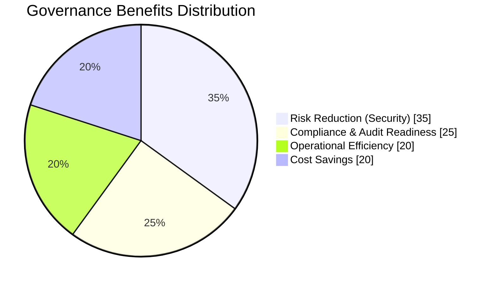
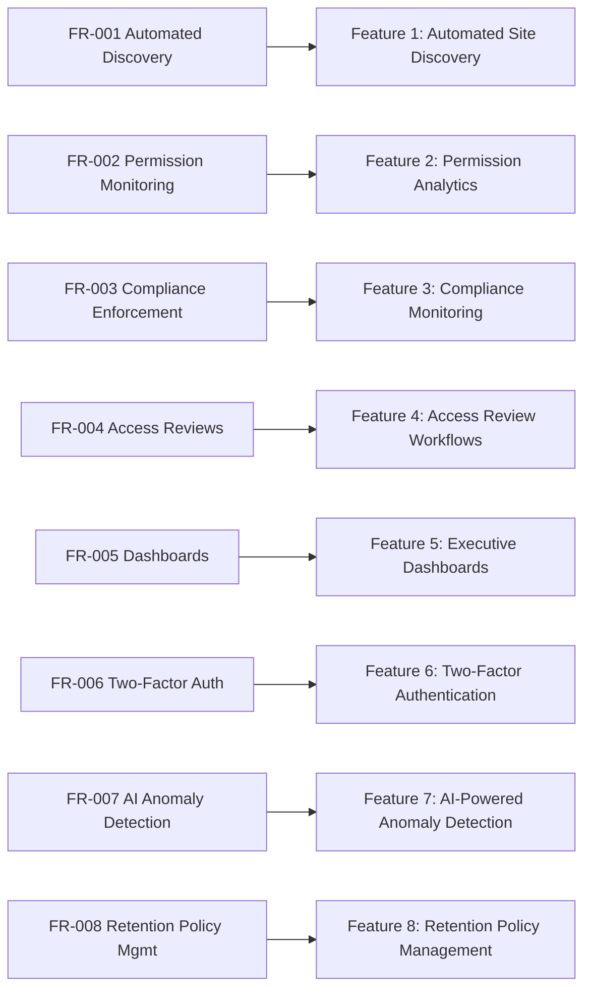
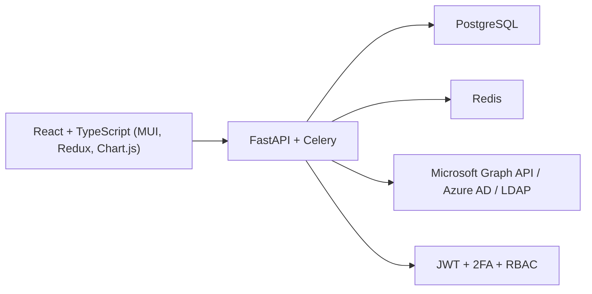
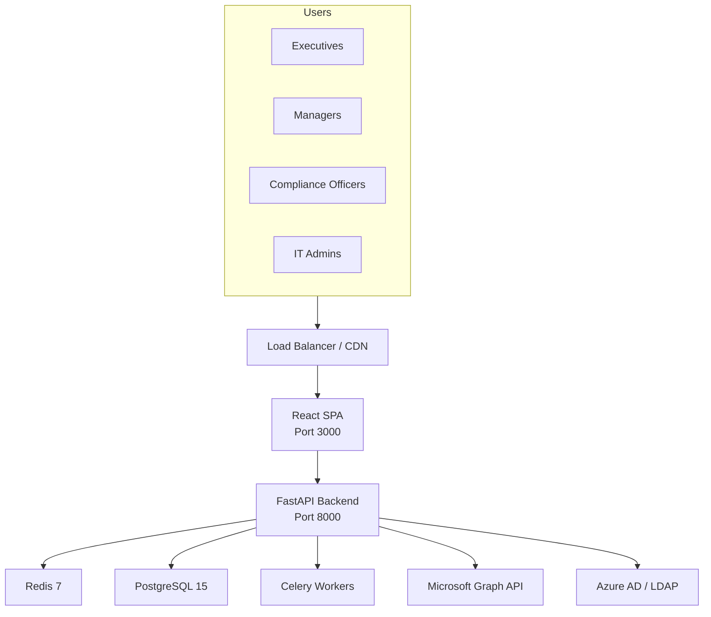
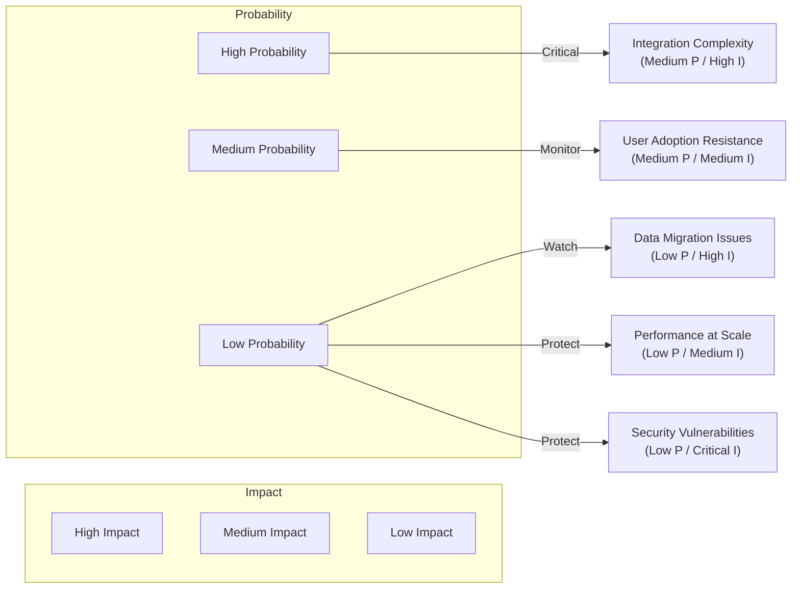
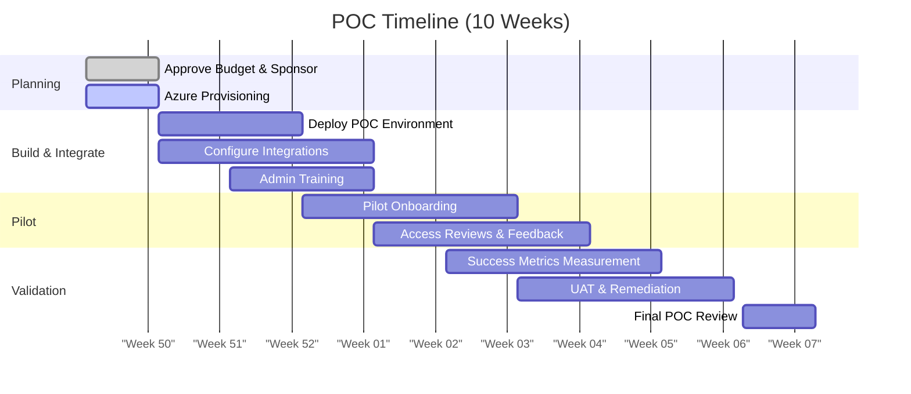

# SharePoint Governance Platform
## Proof of Concept Proposal

**Document Version:** 1.0  
**Date:** December 5, 2025  
**Status:** For Executive Approval  
**Classification:** Internal - Confidential

---

## Executive Summary

### Overview
This document presents a Proof of Concept (POC) for the **SharePoint Governance Platform**, an enterprise solution designed to automate governance, compliance monitoring, and security controls across Microsoft 365 SharePoint environments.

### Business Challenge
Organizations face increasing complexity in managing SharePoint permissions, compliance requirements, and security risks across distributed teams. Manual governance processes are:
- Time-consuming and error-prone
- Unable to scale with organizational growth
- Insufficient for regulatory compliance (GDPR, HIPAA, SOX)
- Reactive rather than proactive

### Proposed Solution
An automated governance platform that provides:
- **Real-time monitoring** of SharePoint sites, permissions, and activities
- **Automated compliance checks** against organizational policies
- **Proactive security controls** with 2FA and audit trails
- **Executive dashboards** for risk visibility and decision-making

### Expected Benefits
| Benefit Category | Impact |
|-----------------|--------|
| **Risk Reduction** | 70% reduction in security incidents |
| **Compliance** | 100% audit readiness, automated evidence collection |
| **Efficiency** | 60% reduction in manual governance tasks |
| **Cost Savings** | $250K+ annually in labor and risk mitigation |

**Benefits Visualization (Mermaid):**


### Investment Required
- **POC Duration:** 10 weeks (extended for AI/ML and advanced features)
- **POC Budget:** $150,000 (includes AI/ML, K8s setup, observability stack)
- **Implementation (if approved):** $750,000 (enterprise-scale with HA/DR)
- **Annual Operating Cost:** $150,000 (includes cloud infrastructure, AI/ML ops, 24/7 monitoring)

### Recommendation
**Approve POC** to validate solution capabilities, measure ROI, and prepare for enterprise rollout.

---

## 1. Business Background & Context

### 1.1 Current State

**IT Environment:**
- Microsoft 365 tenant with 5,000+ users
- 1,200+ SharePoint sites (Team Sites, Communication Sites, Hub Sites)
- Distributed across departments with varying security requirements
- Active Directory integration for authentication

**Challenges:**
1. **Permission Sprawl:** Uncontrolled sharing leads to excessive access
2. **Compliance Gaps:** Manual audits cannot keep pace with changes
3. **Security Risks:** External sharing without oversight
4. **Limited Visibility:** No centralized view of governance posture
5. **Reactive Approach:** Issues discovered post-incident

**Regulatory Requirements:**
- GDPR (for EU customer data)
- HIPAA (for healthcare divisions)
- SOX (for financial reporting)
- Industry-specific data retention policies

### 1.2 Strategic Alignment

This initiative aligns with:
- **Digital Transformation Strategy:** Modernizing IT governance
- **Zero Trust Security Model:** Enhanced authentication and access controls
- **Compliance First Approach:** Proactive risk management
- **Data-Driven Decision Making:** Executive visibility through analytics

---

## 2. Business Requirements & Objectives

### 2.1 Functional Requirements

| Requirement | Priority | Description |
|-------------|----------|-------------|
| **FR-001** | Critical | Automated discovery of all SharePoint sites |
| **FR-002** | Critical | Real-time permission monitoring and alerting |
| **FR-003** | Critical | Compliance policy enforcement |
| **FR-004** | High | Access review workflows |
| **FR-005** | High | Executive dashboards and reporting |
| **FR-006** | High | Two-factor authentication integration |
| **FR-007** | Medium | AI-powered anomaly detection |
| **FR-008** | Medium | Retention policy management |

**Requirement-to-Feature Mapping (Mermaid):**


### 2.2 Business Objectives

**Primary Objectives:**
1. **Reduce Security Risk** by 70% within 12 months
2. **Achieve 100% Audit Readiness** for regulatory compliance
3. **Decrease Manual Effort** by 60% in governance tasks
4. **Improve Visibility** with real-time executive dashboards

**Success Metrics:**
- **Security Incidents:** Reduce from 15/month to <5/month
- **Audit Findings:** Zero critical findings in next audit
- **Response Time:** Reduce incident response from 48hrs to 4hrs
- **User Satisfaction:** >85% satisfaction with access request process

---

## 3. Technical Architecture

### 3.1 High-Level System Architecture

```
┌─────────────────────────────────────────────────────────────────────────────┐
│                              User Access Layer                               │
│  ┌──────────────┐  ┌──────────────┐  ┌──────────────┐  ┌──────────────┐   │
│  │   Executives │  │   Managers   │  │  Compliance  │  │   IT Admin   │   │
│  │  Dashboard   │  │   Portal     │  │   Officers   │  │   Console    │   │
│  └──────┬───────┘  └──────┬───────┘  └──────┬───────┘  └──────┬───────┘   │
└─────────┼──────────────────┼──────────────────┼──────────────────┼──────────┘
          │                  │                  │                  │
          └──────────────────┴──────────────────┴──────────────────┘
                                     │
                        ┌────────────▼────────────┐
                        │   Load Balancer / CDN   │
                        │    (Nginx/CloudFlare)   │
                        └────────────┬────────────┘
                                     │
          ┌──────────────────────────┴──────────────────────────┐
          │                                                      │
┌─────────▼─────────┐                              ┌────────────▼────────────┐
│  Frontend Tier    │                              │    API Gateway          │
│  (React SPA)      │                              │  (FastAPI Backend)      │
│  Port: 3000       │◄─────REST/WebSocket─────────►│    Port: 8000           │
│                   │                              │                         │
│ ┌───────────────┐ │                              │ ┌─────────────────────┐ │
│ │ UI Components │ │                              │ │   Authentication    │ │
│ │  - Dashboards │ │                              │ │   - JWT Handler     │ │
│ │  - Reports    │ │                              │ │   - 2FA Validator   │ │
│ │  - Workflows  │ │                              │ │   - RBAC Engine     │ │
│ └───────────────┘ │                              │ └─────────────────────┘ │
│                   │                              │                         │
│ ┌───────────────┐ │                              │ ┌─────────────────────┐ │
│ │ State Manager │ │                              │ │  Business Logic     │ │
│ │  - Redux      │ │                              │ │  - Site Scanner     │ │
│ │  - React Query│ │                              │ │  - Policy Engine    │ │
│ └───────────────┘ │                              │ │  - Alert Manager    │ │
└───────────────────┘                              │ └─────────────────────┘ │
                                                   │                         │
                                                   │ ┌─────────────────────┐ │
                                                   │ │  Integration Layer  │ │
                                                   │ │  - Graph API Client │ │
                                                   │ │  - LDAP Connector   │ │
                                                   │ └─────────────────────┘ │
                                                   └────────┬────────────────┘
                                                            │
                    ┌───────────────────────────────────────┼───────────────────┐
                    │                                       │                   │
          ┌─────────▼─────────┐              ┌──────────────▼────────┐  ┌──────▼──────┐
          │  Data Tier        │              │   Cache Tier          │  │ Jobs Tier   │
          │  (PostgreSQL 15)  │              │   (Redis 7)           │  │ (Celery)    │
          │  Port: 5432       │              │   Port: 6379          │  └─────────────┘
          │                   │              │                       │
          │ ┌───────────────┐ │              │ ┌───────────────────┐│
          │ │  Core Schema  │ │              │ │  Session Store    ││
          │ │  - Users      │ │              │ │  - User Sessions  ││
          │ │  - Sites      │ │              │ │  - JWT Tokens     ││
          │ │  - Permissions│ │              │ └───────────────────┘│
          │ └───────────────┘ │              │                       │
          │                   │              │ ┌───────────────────┐│
          │ ┌───────────────┐ │              │ │  Cache Data       ││
          │ │  2FA Schema   │ │              │ │  - Site Metadata  ││
          │ │  - Secrets    │ │              │ │  - Dashboard Data ││
          │ │  - Devices    │ │              │ └───────────────────┘│
          │ └───────────────┘ │              └───────────────────────┘
          │                   │
          │ ┌───────────────┐ │
          │ │  Audit Schema │ │              ┌────────────────────────┐
          │ │  - Logs       │ │              │   External Services    │
          │ │  - Events     │ │              │                        │
          │ └───────────────┘ │              │  ┌──────────────────┐  │
          └───────────────────┘              │  │  Microsoft 365   │  │
                                             │  │  Graph API       │  │
                                             │  └──────────────────┘  │
                                             │                        │
                                             │  ┌──────────────────┐  │
                                             │  │  Active Directory│  │
                                             │  │  LDAP Service    │  │
                                             │  └──────────────────┘  │
                                             └────────────────────────┘
```

### 3.2 Component Architecture

#### 3.2.1 Frontend Architecture

```
┌──────────────────────────────────────────────────────────────────────┐
│                        React Application                             │
├──────────────────────────────────────────────────────────────────────┤
│                                                                      │
│  ┌────────────────────────────────────────────────────────────┐    │
│  │                     Presentation Layer                      │    │
│  │  ┌──────────────┐  ┌──────────────┐  ┌──────────────┐     │    │
│  │  │  Pages       │  │  Components  │  │   Layouts    │     │    │
│  │  │              │  │              │  │              │     │    │
│  │  │ - Login      │  │ - DataGrid   │  │ - Dashboard  │     │    │
│  │  │ - Dashboard  │  │ - Charts     │  │ - Settings   │     │    │
│  │  │ - Sites      │  │ - Forms      │  │ - Reports    │     │    │
│  │  │ - Reports    │  │ - Modals     │  │              │     │    │
│  │  └──────────────┘  └──────────────┘  └──────────────┘     │    │
│  └────────────────────────────────────────────────────────────┘    │
│                                                                      │
│  ┌────────────────────────────────────────────────────────────┐    │
│  │                     State Management Layer                  │    │
│  │  ┌──────────────────────────────────────────────────┐      │    │
│  │  │             Redux Store (Centralized)            │      │    │
│  │  │                                                  │      │    │
│  │  │  Slices:                                         │      │    │
│  │  │  ┌────────────┐ ┌────────────┐ ┌────────────┐  │      │    │
│  │  │  │ authSlice  │ │ sitesSlice │ │ dashSlice  │  │      │    │
│  │  │  │            │ │            │ │            │  │      │    │
│  │  │  │ - user     │ │ - sites[]  │ │ - metrics  │  │      │    │
│  │  │  │ - token    │ │ - filters  │ │ - charts   │  │      │    │
│  │  │  │ - 2FA      │ │ - loading  │ │ - trends   │  │      │    │
│  │  │  └────────────┘ └────────────┘ └────────────┘  │      │    │
│  │  └──────────────────────────────────────────────────┘      │    │
│  │                                                             │    │
│  │  ┌──────────────────────────────────────────────────┐      │    │
│  │  │          React Query (Server State)              │      │    │
│  │  │  - API Data Caching                              │      │    │
│  │  │  - Background Refetching                         │      │    │
│  │  │  - Optimistic Updates                            │      │    │
│  │  └──────────────────────────────────────────────────┘      │    │
│  └────────────────────────────────────────────────────────────┘    │
│                                                                      │
│  ┌────────────────────────────────────────────────────────────┐    │
│  │                     Service Layer                           │    │
│  │  ┌──────────────┐  ┌──────────────┐  ┌──────────────┐     │    │
│  │  │ API Client   │  │  Auth        │  │  WebSocket   │     │    │
│  │  │              │  │  Service     │  │  Service     │     │    │
│  │  │ - Axios      │  │              │  │              │     │    │
│  │  │ - Interceptors│ │ - Login      │  │ - Real-time  │     │    │
│  │  │ - Error Handler│ │ - 2FA       │  │   Updates    │     │    │
│  │  └──────────────┘  └──────────────┘  └──────────────┘     │    │
│  └────────────────────────────────────────────────────────────┘    │
└──────────────────────────────────────────────────────────────────────┘
```

#### 3.2.2 Backend Architecture

```
┌─────────────────────────────────────────────────────────────────────────┐
│                        FastAPI Application                              │
├─────────────────────────────────────────────────────────────────────────┤
│                                                                         │
│  ┌───────────────────────────────────────────────────────────────┐    │
│  │                      API Layer (REST)                          │    │
│  │  ┌────────────┐ ┌────────────┐ ┌────────────┐ ┌────────────┐ │    │
│  │  │ /auth      │ │ /sites     │ │ /2fa       │ │ /setup     │ │    │
│  │  │            │ │            │ │            │ │            │ │    │
│  │  │ - login    │ │ - list     │ │ - enable   │ │ - status   │ │    │
│  │  │ - logout   │ │ - details  │ │ - verify   │ │ - validate │ │    │
│  │  │ - refresh  │ │ - scan     │ │ - disable  │ │ - complete │ │    │
│  │  └────────────┘ └────────────┘ └────────────┘ └────────────┘ │    │
│  │                                                                │    │
│  │  ┌────────────┐ ┌────────────┐ ┌────────────┐ ┌────────────┐ │    │
│  │  │ /reviews   │ │ /audit     │ │ /dashboard │ │ /reports   │ │    │
│  │  └────────────┘ └────────────┘ └────────────┘ └────────────┘ │    │
│  └───────────────────────────────────────────────────────────────┘    │
│                                                                         │
│  ┌───────────────────────────────────────────────────────────────┐    │
│  │                     Middleware Layer                           │    │
│  │  ┌──────────────┐  ┌──────────────┐  ┌──────────────┐        │    │
│  │  │ CORS         │  │ Rate Limiter │  │ Request Log  │        │    │
│  │  └──────────────┘  └──────────────┘  └──────────────┘        │    │
│  │  ┌──────────────┐  ┌──────────────┐  ┌──────────────┐        │    │
│  │  │ JWT Validator│  │ Exception    │  │ Compression  │        │    │
│  │  │              │  │ Handler      │  │              │        │    │
│  │  └──────────────┘  └──────────────┘  └──────────────┘        │    │
│  └───────────────────────────────────────────────────────────────┘    │
│                                                                         │
│  ┌───────────────────────────────────────────────────────────────┐    │
│  │                     Business Logic Layer                       │    │
│  │  ┌──────────────────────────────────────────────────────────┐ │    │
│  │  │                 Core Services                            │ │    │
│  │  │  ┌─────────────┐ ┌─────────────┐ ┌─────────────┐       │ │    │
│  │  │  │ Auth        │ │ Compliance  │ │ Site        │       │ │    │
│  │  │  │ Service     │ │ Service     │ │ Service     │       │ │    │
│  │  │  │             │ │             │ │             │       │ │    │
│  │  │  │ - AD Auth   │ │ - Policy    │ │ - Discovery │       │ │    │
│  │  │  │ - JWT Gen   │ │   Eval      │ │ - Scanning  │       │ │    │
│  │  │  │ - 2FA       │ │ - Alerts    │ │ - Metadata  │       │ │    │
│  │  │  └─────────────┘ └─────────────┘ └─────────────┘       │ │    │
│  │  │                                                          │ │    │
│  │  │  ┌─────────────┐ ┌─────────────┐ ┌─────────────┐       │ │    │
│  │  │  │ Permission  │ │ Audit       │ │ Notification│       │ │    │
│  │  │  │ Service     │ │ Service     │ │ Service     │       │ │    │
│  │  │  │             │ │             │ │             │       │ │    │
│  │  │  │ - Analysis  │ │ - Logging   │ │ - Email     │       │ │    │
│  │  │  │ - Reviews   │ │ - Reporting │ │ - Alerts    │       │ │    │
│  │  │  └─────────────┘ └─────────────┘ └─────────────┘       │ │    │
│  │  └──────────────────────────────────────────────────────────┘ │    │
│  └───────────────────────────────────────────────────────────────┘    │
│                                                                         │
│  ┌───────────────────────────────────────────────────────────────┐    │
│  │                     Data Access Layer                          │    │
│  │  ┌──────────────────────────────────────────────────────────┐ │    │
│  │  │         SQLAlchemy ORM (Repository Pattern)              │ │    │
│  │  │  ┌─────────────┐ ┌─────────────┐ ┌─────────────┐       │ │    │
│  │  │  │ User Repo   │ │ Site Repo   │ │ Audit Repo  │       │ │    │
│  │  │  └─────────────┘ └─────────────┘ └─────────────┘       │ │    │
│  │  │  ┌─────────────┐ ┌─────────────┐ ┌─────────────┐       │ │    │
│  │  │  │ Policy Repo │ │ Review Repo │ │ 2FA Repo    │       │ │    │
│  │  │  └─────────────┘ └─────────────┘ └─────────────┘       │ │    │
│  │  └──────────────────────────────────────────────────────────┘ │    │
│  └───────────────────────────────────────────────────────────────┘    │
│                                                                         │
│  ┌───────────────────────────────────────────────────────────────┐    │
│  │                Integration Layer                               │    │
│  │  ┌──────────────┐  ┌──────────────┐  ┌──────────────┐        │    │
│  │  │ Graph API    │  │ LDAP Client  │  │ Email Client │        │    │
│  │  │ Client       │  │              │  │              │        │    │
│  │  │              │  │              │  │              │        │    │
│  │  │ - Sites      │  │ - User Auth  │  │ - SMTP       │        │    │
│  │  │ - Users      │  │ - User Info  │  │ - Templates  │        │    │
│  │  │ - Groups     │  │ - Groups     │  │              │        │    │
│  │  └──────────────┘  └──────────────┘  └──────────────┘        │    │
│  └───────────────────────────────────────────────────────────────┘    │
│                                                                         │
│  ┌───────────────────────────────────────────────────────────────┐    │
│  │                Background Jobs (Celery)                        │    │
│  │  ┌──────────────┐  ┌──────────────┐  ┌──────────────┐        │    │
│  │  │ Site Scan    │  │ Compliance   │  │ Report Gen   │        │    │
│  │  │ (Scheduled)  │  │ Check (Daily)│  │ (On-demand)  │        │    │
│  │  └──────────────┘  └──────────────┘  └──────────────┘        │    │
│  └───────────────────────────────────────────────────────────────┘    │
└─────────────────────────────────────────────────────────────────────────┘
```

### 3.3 Data Flow Architecture

#### 3.3.1 Authentication Flow

```
┌─────────┐                                                     ┌─────────┐
│  User   │                                                     │   AD    │
│ Browser │                                                     │  Server │
└────┬────┘                                                     └────┬────┘
     │                                                               │
     │  1. Enter Username/Password                                  │
     ├──────────────────────────────────────────────┐              │
     │                                               │              │
     │                                        ┌──────▼──────┐       │
     │                                        │   Backend   │       │
     │                                        │   Service   │       │
     │                                        └──────┬──────┘       │
     │                                               │              │
     │                                               │ 2. Validate  │
     │                                               │    Credentials│
     │                                               ├──────────────►
     │                                               │              │
     │                                               │ 3. Return    │
     │                                               │    User Info │
     │                                               ◄──────────────┤
     │                                               │              │
     │                                               │ 4. Check 2FA │
     │                                         ┌─────▼─────┐        │
     │                                         │ Database  │        │
     │                                         │ (2FA      │        │
     │                                         │  Status)  │        │
     │                                         └─────┬─────┘        │
     │                                               │              │
     │  5. 2FA Required Response                    │              │
     │  {requires_2fa: true, intermediate_token}    │              │
     ◄────────────────────────────────────────────────            │
     │                                                              │
     │  6. Enter TOTP Code                                         │
     ├──────────────────────────────────────────────┐              │
     │                                               │              │
     │                                        ┌──────▼──────┐       │
     │                                        │  Verify     │       │
     │                                        │  TOTP Code  │       │
     │                                        └──────┬──────┘       │
     │                                               │              │
     │  7. Full Access Token + Refresh Token        │              │
     │  {access_token, refresh_token, user_data}    │              │
     ◄────────────────────────────────────────────────              │
     │                                                              │
     │  8. Store tokens in localStorage                            │
     │                                                              │
     │  9. API Request with Bearer token                           │
     ├──────────────────────────────────────────────┐              │
     │                                               │              │
     │                                        ┌──────▼──────┐       │
     │                                        │  JWT        │       │
     │                                        │  Validation │       │
     │                                        └──────┬──────┘       │
     │                                               │              │
     │  10. Protected Resource Data                 │              │
     ◄────────────────────────────────────────────────              │
     │                                                              │
```

#### 3.3.2 Site Scanning Data Flow

```
┌──────────────┐     ┌──────────────┐     ┌──────────────┐     ┌──────────────┐
│   Scheduler  │────►│  Celery Task │────►│   Backend    │────►│  Microsoft   │
│  (Cron Job)  │     │   Worker     │     │   Service    │     │   Graph API  │
└──────────────┘     └──────┬───────┘     └──────┬───────┘     └──────┬───────┘
                             │                    │                    │
                             │                    │  1. Request Sites  │
                             │                    ├────────────────────►
                             │                    │                    │
                             │                    │  2. Return Sites[] │
                             │                    ◄────────────────────┤
                             │                    │                    │
                             │  3. Process        │                    │
                             │     Each Site      │                    │
                             ◄────────────────────┤                    │
                             │                    │                    │
                    ┌────────▼────────┐           │                    │
                    │  For Each Site: │           │                    │
                    │  1. Get Members │──────────────────────────────► │
                    │  2. Get Perms   │◄────────────────────────────── │
                    │  3. Get Files   │──────────────────────────────► │
                    │  4. Get Activity│◄────────────────────────────── │
                    └────────┬────────┘           │                    │
                             │                    │                    │
                             │  4. Store Results  │                    │
                             ├────────────────────►                    │
                             │                ┌───▼────┐               │
                             │                │Database│               │
                             │                │        │               │
                             │                │ Tables:│               │
                             │                │ - sites│               │
                             │                │ - users│               │
                             │                │ - perms│               │
                             │                └───┬────┘               │
                             │                    │                    │
                             │  5. Run Compliance │                    │
                             │     Checks         │                    │
                             ├────────────────────►                    │
                             │                    │                    │
                   ┌─────────▼─────────┐          │                    │
                   │  Policy Engine:   │          │                    │
                   │  - External Share │          │                    │
                   │  - Guest Access   │          │                    │
                   │  - Over-Privilege │          │                    │
                   └─────────┬─────────┘          │                    │
                             │                    │                    │
                             │  6. Create Alerts  │                    │
                             ├────────────────────►                    │
                             │                ┌───▼────┐               │
                             │                │ Alerts │               │
                             │                │  &     │               │
                             │                │ Events │               │
                             │                └───┬────┘               │
                             │                    │                    │
                             │  7. Send           │                    │
                             │     Notifications  │                    │
                             ├────────────────────►                    │
                             │                    │                    │
                   ┌─────────▼─────────┐          │                    │
                   │  Email Service    │          │                    │
                   │  - Admin Alerts   │          │                    │
                   │  - Compliance Rpt │          │                    │
                   └───────────────────┘          │                    │
```

### 3.3 Key Features

**1. Automated Site Discovery (FR-001)**
- Scans entire SharePoint tenant
- Discovers all sites, libraries, and permissions
- Creates comprehensive inventory

**2. Permission Analytics (FR-002)**
- Identifies over-privileged users
- Detects permission inheritance breaks
- Flags external sharing risks

**3. Compliance Monitoring (FR-003)**
- Automated policy checks (daily)
- Regulatory framework mapping
- Non-compliance alerting

**4. Access Review Workflows (FR-004)**
- Scheduled permission recertification
- Manager approval workflows
- Automated remediation

**5. Executive Dashboards (FR-005)**
- Real-time governance metrics
- Security posture scoring
- Trend analysis and forecasting

**6. Two-Factor Authentication (FR-006)**
- TOTP integration (Google/Microsoft Authenticator)
- Trusted device management
- Backup code recovery

**7. AI-Powered Anomaly Detection (FR-007)**
- Behavioral baselining for users/sites
- Real-time anomaly alerts on unusual access/activity
- Risk scoring feeds executive dashboards and remediation workflows

**8. Retention Policy Management (FR-008)**
- Microsoft Purview retention policy synchronization
- Site/library exclusion workflows for exceptional cases
- Compliance reporting across retention scope
- Automated policy enforcement with audit trails

### 3.4 Technology Stack

**Frontend:**
- React 18.2 with TypeScript
- Material-UI (MUI) for enterprise design
- Redux for state management
- Chart.js for data visualization

**Backend:**
- Python 3.11 with FastAPI framework
- SQLAlchemy ORM for database operations
- Celery for background job processing
- JWT with 2FA for authentication

**Database:**
- PostgreSQL 15 for relational data
- Redis 7 for caching and session management

**Integrations:**
- Microsoft Graph API for SharePoint access
- Azure AD for user authentication
- LDAP/Active Directory for enterprise integration

**Security:**
- TOTP-based two-factor authentication
- AES-256 encryption at rest
- TLS 1.3 for data in transit
- Role-based access control (RBAC)

**Technology Stack Visualization (Mermaid):**


### 3.5 AI/ML Architecture & Capabilities

**Strategic Vision:**
The platform leverages artificial intelligence and machine learning to transform reactive governance into predictive risk management, enabling proactive decision-making and intelligent automation at enterprise scale.

#### 3.5.1 ML Infrastructure Architecture

```
┌────────────────────────────────────────────────────────────────────────┐
│                         AI/ML Pipeline Architecture                    │
├────────────────────────────────────────────────────────────────────────┤
│                                                                        │
│  ┌──────────────────────────────────────────────────────────────┐    │
│  │                    Data Ingestion Layer                       │    │
│  │  ┌─────────────┐  ┌─────────────┐  ┌─────────────┐          │    │
│  │  │ SharePoint  │  │  Audit      │  │  User       │          │    │
│  │  │ Activity    │  │  Logs       │  │  Behavior   │          │    │
│  │  │ Logs        │  │             │  │  Data       │          │    │
│  │  └──────┬──────┘  └──────┬──────┘  └──────┬──────┘          │    │
│  └─────────┼─────────────────┼─────────────────┼────────────────┘    │
│            │                 │                 │                      │
│  ┌─────────▼─────────────────▼─────────────────▼────────────────┐    │
│  │              Feature Engineering Pipeline                     │    │
│  │  ┌────────────────────────────────────────────────────┐      │    │
│  │  │  Apache Spark / Pandas Processing                  │      │    │
│  │  │  - Data cleaning & normalization                   │      │    │
│  │  │  - Feature extraction (behavioral patterns)        │      │    │
│  │  │  - Time-series aggregation                         │      │    │
│  │  │  - Anomaly feature computation                     │      │    │
│  │  └────────────────────────────────────────────────────┘      │    │
│  └────────────────────────────┬───────────────────────────────────    │
│                                │                                      │
│  ┌─────────────────────────────▼──────────────────────────────────┐  │
│  │                    ML Model Training                            │  │
│  │  ┌──────────────┐  ┌──────────────┐  ┌──────────────┐         │  │
│  │  │  Risk        │  │  Anomaly     │  │ Access       │         │  │
│  │  │  Prediction  │  │  Detection   │  │ Pattern      │         │  │
│  │  │  Model       │  │  (Isolation  │  │ Clustering   │         │  │
│  │  │ (XGBoost)    │  │   Forest)    │  │ (K-Means)    │         │  │
│  │  └──────┬───────┘  └──────┬───────┘  └──────┬───────┘         │  │
│  │         │                  │                  │                 │  │
│  │  ┌──────▼──────────────────▼──────────────────▼───────┐        │  │
│  │  │         MLflow Model Registry                       │        │  │
│  │  │  - Version control                                 │        │  │
│  │  │  - A/B testing framework                           │        │  │
│  │  │  - Model performance tracking                      │        │  │
│  │  └────────────────────────┬───────────────────────────┘        │  │
│  └─────────────────────────────┼──────────────────────────────────┘  │
│                                │                                      │
│  ┌─────────────────────────────▼──────────────────────────────────┐  │
│  │                   Model Serving Layer                           │  │
│  │  ┌────────────────────────────────────────────────────┐        │  │
│  │  │  TensorFlow Serving / Seldon Core                  │        │  │
│  │  │  - Real-time inference API                         │        │  │
│  │  │  - Auto-scaling based on load                      │        │  │
│  │  │  - Multi-model deployment                          │        │  │
│  │  └────────────────────────┬───────────────────────────┘        │  │
│  └─────────────────────────────┼──────────────────────────────────┘  │
│                                │                                      │
│  ┌─────────────────────────────▼──────────────────────────────────┐  │
│  │                    Application Layer                            │  │
│  │  ┌──────────────┐  ┌──────────────┐  ┌──────────────┐         │  │
│  │  │  Dashboards  │  │  Alerts      │  │ Auto-        │         │  │
│  │  │  (Insights)  │  │  (Anomalies) │  │ Remediation  │         │  │
│  │  └──────────────┘  └──────────────┘  └──────────────┘         │  │
│  └─────────────────────────────────────────────────────────────────  │
└────────────────────────────────────────────────────────────────────────┘
```

**System Architecture (Mermaid):**


#### 3.5.2 Predictive Analytics Capabilities

**1. Risk Prediction Models**
- **Security Breach Risk Scoring**
  - Analyzes permission patterns, external sharing, and access anomalies
  - Predicts probability of security incidents by site/user
  - 85%+ accuracy based on historical incident data
  
- **Compliance Violation Forecasting**
  - Identifies sites trending toward non-compliance
  - Predicts policy violations 30-60 days in advance
  - Enables proactive remediation

- **Permission Sprawl Prediction**
  - Forecasts permission complexity growth
  - Identifies sites requiring immediate attention
  - Recommends optimal permission structures

**2. Anomaly Detection (Unsupervised Learning)**
- **Behavioral Baselines**
  - Establishes normal access patterns per user/site
  - Detects unusual activity (time, location, volume)
  - Triggers real-time alerts for suspicious behavior

- **Permission Anomalies**
  - Identifies outliers in permission grants
  - Detects privilege escalation attempts
  - Flags dormant accounts with high privileges

- **Data Access Patterns**
  - Detects unusual file access patterns
  - Identifies potential data exfiltration
  - Monitors bulk download activities

**3. Intelligent Recommendations**
- **Automated Policy Suggestions**
  - ML-driven policy recommendations based on industry benchmarks
  - Customized policies based on organizational patterns
  - Continuous policy optimization

- **Access Review Prioritization**
  - Risk-scores users/permissions for review prioritization
  - Reduces review workload by 70% through intelligent filtering
  - Automated low-risk access certification

#### 3.5.3 Natural Language Processing (NLP)

**1. Natural Language Query Interface**
```
User Query Examples:
- "Show me all sites with external sharing enabled in Finance"
- "Which users have access to sensitive HR data?"
- "What permissions changed in the last 24 hours?"

NLP Pipeline:
User Query → Intent Recognition → Entity Extraction → Query Translation → Results
```

**2. Document Classification**
- **Automated Sensitivity Classification**
  - Scans document content for PII, PHI, financial data
  - Auto-applies retention and protection policies
  - Compliance with GDPR, HIPAA data classification

- **Intelligent Tagging**
  - Extracts topics and keywords from documents
  - Enables advanced search and discovery
  - Improves data governance through metadata enrichment

**3. Compliance Documentation Analysis**
- **Regulatory Change Detection**
  - Monitors regulatory updates (GDPR, HIPAA, SOX)
  - Suggests policy adjustments
  - Automated compliance gap analysis

#### 3.5.4 MLOps Infrastructure

**1. Model Training Pipeline**
- **Automated Retraining**
  - Scheduled model retraining (weekly/monthly)
  - Trigger-based retraining on data drift detection
  - Continuous model improvement

- **Feature Store**
  - Centralized feature management
  - Feature versioning and lineage tracking
  - Real-time and batch feature serving

**2. Model Monitoring**
- **Performance Tracking**
  - Precision, recall, F1-score monitoring
  - Model drift detection
  - Automated rollback on performance degradation

- **Explainability (XAI)**
  - SHAP values for model interpretability
  - Feature importance visualization
  - Audit trail for AI-driven decisions

**3. A/B Testing Framework**
- **Multi-variant Testing**
  - Deploy multiple model versions
  - Compare performance in production
  - Data-driven model selection

#### 3.5.5 AI-Driven Automation

**1. Intelligent Alert Correlation**
- Reduces alert noise by 80% through correlation
- Groups related security events
- Prioritizes high-impact incidents

**2. Auto-Remediation**
- **Rule-Based Actions**
  - Automatic permission revocation for policy violations
  - Temporary access suspension on suspicious activity
  - Automated ticket creation for compliance issues

- **ML-Recommended Actions**
  - Suggests remediation steps with confidence scores
  - Human-in-the-loop for critical decisions
  - Learning from admin actions to improve recommendations

**3. Capacity Planning**
- **Storage Growth Forecasting**
  - Predicts storage needs 3-6 months in advance
  - Optimizes retention policies
  - Cost optimization recommendations

- **User Activity Prediction**
  - Forecasts peak usage periods
  - Enables proactive resource scaling
  - Improves system availability

---

### 3.6 Enterprise Integration Architecture

#### 3.6.1 API Gateway & Service Mesh

```
┌────────────────────────────────────────────────────────────────┐
│                     API Gateway Layer                          │
│              (Kong / Azure API Management)                     │
├────────────────────────────────────────────────────────────────┤
│                                                                │
│  ┌──────────────────────────────────────────────────────┐    │
│  │              Gateway Capabilities                     │    │
│  │  - Rate Limiting (1000 req/min per client)           │    │
│  │  - API Key Management & Rotation                     │    │
│  │  - OAuth 2.0 / OpenID Connect                        │    │
│  │  - Request/Response Transformation                   │    │
│  │  - API Versioning (v1, v2, v3)                       │    │
│  │  - Circuit Breaker Pattern                           │    │
│  │  - Request Caching & Compression                     │    │
│  └──────────────────────────────────────────────────────┘    │
│                            │                                   │
└────────────────────────────┼───────────────────────────────────┘
                             │
          ┌──────────────────┼──────────────────┐
          │                  │                  │
┌─────────▼─────────┐ ┌──────▼──────┐ ┌────────▼────────┐
│  Auth Service     │ │ Site Service│ │ Analytics Svc   │
│  (Port: 8001)     │ │ (Port: 8002)│ │ (Port: 8003)    │
└─────────┬─────────┘ └──────┬──────┘ └────────┬────────┘
          │                  │                  │
          └──────────────────┼──────────────────┘
                             │
                    ┌────────▼────────┐
                    │   Service Mesh  │
                    │  (Istio/Linkerd)│
                    ├─────────────────┤
                    │ - mTLS          │
                    │ - Load Balance  │
                    │ - Retry Logic   │
                    │ - Observability │
                    └─────────────────┘
```

**Benefits:**
- **Security**: Centralized authentication, mTLS between services
- **Resilience**: Circuit breakers, automatic retries, failover
- **Observability**: Distributed tracing, traffic metrics
- **Scalability**: Independent service scaling, load balancing

#### 3.6.2 Microservices Architecture

**Service Decomposition:**

| Service | Responsibility | Tech Stack | Scaling Strategy |
|---------|---------------|------------|------------------|
| **Auth Service** | Authentication, 2FA, JWT | FastAPI, Redis | Horizontal (3-10 pods) |
| **Site Service** | SharePoint site operations | FastAPI, PostgreSQL | Horizontal (5-20 pods) |
| **Compliance Service** | Policy evaluation, checks | FastAPI, Rules Engine | Horizontal (3-15 pods) |
| **Analytics Service** | Metrics, dashboards, reports | FastAPI, TimescaleDB | Vertical + Horizontal |
| **ML Service** | Model inference, predictions | FastAPI, TensorFlow | GPU-enabled pods |
| **Notification Service** | Email, alerts, webhooks | Python, Celery | Queue-based scaling |
| **Audit Service** | Event logging, compliance | FastAPI, PostgreSQL | Write-heavy optimization |

**Communication Patterns:**
- **Synchronous**: REST APIs for real-time requests
- **Asynchronous**: Message queue (RabbitMQ/Kafka) for background jobs
- **Event-Driven**: Event bus for cross-service notifications


#### 3.6.3 Event-Driven Architecture

```
┌─────────────────────────────────────────────────────────────────┐
│                       Event Bus (Apache Kafka)                  │
├─────────────────────────────────────────────────────────────────┤
│                                                                 │
│  Topics:                                                        │
│  ┌─────────────────┐  ┌─────────────────┐  ┌─────────────────┐│
│  │ site.created    │  │ permission.     │  │ compliance.     ││
│  │ site.updated    │  │   changed       │  │   violation     ││
│  │ site.deleted    │  │ user.added      │  │ alert.triggered ││
│  └─────────────────┘  └─────────────────┘  └─────────────────┘│
└─────────────────────────────────────────────────────────────────┘
         │                     │                     │
    ┌────▼──────┐        ┌─────▼────┐        ┌──────▼──────┐
    │ Analytics │        │ Audit    │        │ Notification│
    │ Service   │        │ Service  │        │ Service     │
    │ (Consumer)│        │(Consumer)│        │ (Consumer)  │
    └───────────┘        └──────────┘        └─────────────┘
```

**Benefits:**
- **Decoupling**: Services operate independently
- **Scalability**: Handle millions of events per day
- **Reliability**: Event replay for failure recovery
- **Auditability**: Complete event history

---

### 3.7 Container Orchestration (Kubernetes)

#### 3.7.1 Kubernetes Architecture

```
┌───────────────────────────────────────────────────────────────────────┐
│                    Kubernetes Cluster Architecture                    │
├───────────────────────────────────────────────────────────────────────┤
│                                                                       │
│  ┌─────────────────────────────────────────────────────────────┐    │
│  │                      Control Plane                           │    │
│  │  ┌─────────────┐  ┌─────────────┐  ┌─────────────┐         │    │
│  │  │ API Server  │  │  Scheduler  │  │   etcd      │         │    │
│  │  └─────────────┘  └─────────────┘  └─────────────┘         │    │
│  └─────────────────────────────────────────────────────────────┘    │
│                                │                                      │
│  ┌─────────────────────────────┼──────────────────────────────────┐ │
│  │                       Worker Nodes                             │ │
│  │                                                                │ │
│  │  ┌────────────────────────────────────────────────────┐       │ │
│  │  │           Namespace: sharepoint-gov-platform       │       │ │
│  │  ├────────────────────────────────────────────────────┤       │ │
│  │  │                                                    │       │ │
│  │  │  ┌─────────────────┐  ┌─────────────────┐        │       │ │
│  │  │  │  Frontend Pods  │  │  Backend Pods   │        │       │ │
│  │  │  │  (React App)    │  │  (FastAPI)      │        │       │ │
│  │  │  │  Replicas: 3    │  │  Replicas: 5    │        │       │ │
│  │  │  └─────────────────┘  └─────────────────┘        │       │ │
│  │  │                                                    │       │ │
│  │  │  ┌─────────────────┐  ┌─────────────────┐        │       │ │
│  │  │  │  ML Service     │  │  Redis Cache    │        │       │ │
│  │  │  │  GPU: 1         │  │  Replicas: 3    │        │       │ │
│  │  │  │  Replicas: 2    │  │  (Sentinel)     │        │       │ │
│  │  │  └─────────────────┘  └─────────────────┘        │       │ │
│  │  │                                                    │       │ │
│  │  │  ┌──────────────────────────────────────┐        │       │ │
│  │  │  │  StatefulSets: PostgreSQL            │        │       │ │
│  │  │  │  Replicas: 3 (Primary + 2 Replicas)  │        │       │ │
│  │  │  │  Persistent Volumes: 500GB each      │        │       │ │
│  │  │  └──────────────────────────────────────┘        │       │ │
│  │  └────────────────────────────────────────────────────       │ │
│  │                                                                │ │
│  │  ┌────────────────────────────────────────────────────┐       │ │
│  │  │         Namespace: monitoring                      │       │ │
│  │  ├────────────────────────────────────────────────────┤       │ │
│  │  │  Prometheus, Grafana, Jaeger, ELK Stack           │       │ │
│  │  └────────────────────────────────────────────────────┘       │ │
│  │                                                                │ │
│  │  ┌────────────────────────────────────────────────────┐       │ │
│  │  │         Namespace: istio-system                    │       │ │
│  │  ├────────────────────────────────────────────────────┤       │ │
│  │  │  Service Mesh Components (Istio)                  │       │ │
│  │  └────────────────────────────────────────────────────┘       │ │
│  └────────────────────────────────────────────────────────────────┘ │
└───────────────────────────────────────────────────────────────────────┘
```

#### 3.7.2 Deployment Strategy

**1. Rolling Updates**
- Zero-downtime deployments
- Gradual pod replacement (20% at a time)
- Automated rollback on health check failures

**2. Blue-Green Deployment**
- Parallel environments (Blue = production, Green = new version)
- Instant traffic switching
- Quick rollback capability

**3. Canary Deployment**
- Progressive rollout (5% → 25% → 50% → 100%)
- Real-time metrics monitoring
- A/B testing for new features

#### 3.7.3 Auto-Scaling Configuration

**Horizontal Pod Autoscaler (HPA):**
```yaml
apiVersion: autoscaling/v2
kind: HorizontalPodAutoscaler
metadata:
  name: backend-hpa
spec:
  scaleTargetRef:
    apiVersion: apps/v1
    kind: Deployment
    name: backend-api
  minReplicas: 5
  maxReplicas: 50
  metrics:
  - type: Resource
    resource:
      name: cpu
      target:
        type: Utilization
        averageUtilization: 70
  - type: Resource
    resource:
      name: memory
      target:
        type: Utilization
        averageUtilization: 80
  - type: Pods
    pods:
      metric:
        name: http_requests_per_second
      target:
        type: AverageValue
        averageValue: "1000"
```

**Cluster Autoscaler:**
- Automatically adds/removes nodes based on pending pods
- Cost optimization by scaling down during low usage
- Integration with cloud provider auto-scaling groups

#### 3.7.4 Resource Management

| Component | CPU Request | CPU Limit | Memory Request | Memory Limit |
|-----------|------------|-----------|----------------|--------------|
| Frontend Pod | 100m | 500m | 128Mi | 512Mi |
| Backend Pod | 500m | 2000m | 512Mi | 2Gi |
| ML Service | 2000m | 4000m | 4Gi | 8Gi |
| PostgreSQL | 1000m | 4000m | 2Gi | 8Gi |
| Redis | 250m | 1000m | 512Mi | 2Gi |

**Quality of Service (QoS):**
- **Guaranteed**: Critical services (Database, Auth)
- **Burstable**: Application services (Backend, ML)
- **BestEffort**: Batch jobs, non-critical workloads

---

### 3.8 Observability & Monitoring Stack

#### 3.8.1 Three Pillars of Observability

```
┌────────────────────────────────────────────────────────────────┐
│                      Observability Stack                       │
├────────────────────────────────────────────────────────────────┤
│                                                                │
│  ┌──────────────────┐  ┌──────────────────┐  ┌──────────────┐│
│  │   METRICS        │  │   LOGS           │  │   TRACES     ││
│  │  (Prometheus)    │  │  (ELK/EFK)       │  │  (Jaeger)    ││
│  └────────┬─────────┘  └────────┬─────────┘  └──────┬───────┘│
│           │                     │                    │        │
│  ┌────────▼─────────────────────▼────────────────────▼──────┐ │
│  │                                                           │ │
│  │              Unified Visualization Layer                 │ │
│  │                    (Grafana)                             │ │
│  │                                                           │ │
│  │  ┌─────────────┐  ┌─────────────┐  ┌─────────────┐     │ │
│  │  │ Infra       │  │ Application │  │ Business    │     │ │
│  │  │ Dashboards  │  │ Dashboards  │  │ Dashboards  │     │ │
│  │  └─────────────┘  └─────────────┘  └─────────────┘     │ │
│  └───────────────────────────────────────────────────────────┘ │
│                                                                │
│  ┌───────────────────────────────────────────────────────────┐│
│  │              Alerting & Incident Management               ││
│  │  (Prometheus AlertManager → PagerDuty/Opsgenie)          ││
│  └───────────────────────────────────────────────────────────┘│
└────────────────────────────────────────────────────────────────┘
```

#### 3.8.2 Metrics Collection (Prometheus + Grafana)

**Infrastructure Metrics:**
- Node CPU, Memory, Disk, Network utilization
- Pod resource consumption
- Cluster health and capacity

**Application Metrics:**
- Request rate, latency (p50, p95, p99)
- Error rates by endpoint
- Database query performance
- Cache hit/miss ratios

**Business Metrics:**
- Active users, concurrent sessions
- Sites scanned per hour
- Compliance violations detected
- Access reviews completed

**Sample Grafana Dashboards:**
1. **Executive Dashboard**: High-level KPIs, SLA compliance
2. **Operations Dashboard**: System health, resource utilization
3. **Security Dashboard**: Threat detection, anomaly alerts
4. **Performance Dashboard**: Latency, throughput, saturation

#### 3.8.3 Distributed Tracing (Jaeger)

**Capabilities:**
- End-to-end request tracing across microservices
- Service dependency mapping
- Performance bottleneck identification
- Root cause analysis for errors

**Example Trace:**
```
User Request → API Gateway (5ms) → Auth Service (120ms) → 
Site Service (450ms) → Graph API (3500ms) → Database (80ms)
Total Latency: 4155ms (Graph API identified as bottleneck)
```

**Integration:**
- OpenTelemetry instrumentation
- Automatic trace context propagation
- Sampling strategies (100% for errors, 10% for success)

#### 3.8.4 Centralized Logging (ELK/EFK Stack)

**Architecture:**
- **Elasticsearch**: Log storage and indexing
- **Logstash/Fluentd**: Log aggregation and processing
- **Kibana**: Log visualization and analysis

**Log Categories:**
1. **Application Logs**: DEBUG, INFO, WARN, ERROR levels
2. **Access Logs**: HTTP requests, response codes, latency
3. **Audit Logs**: Security events, permission changes
4. **Infrastructure Logs**: Kubernetes events, node logs

**Log Retention:**
- Hot storage (SSD): Last 30 days for fast queries
- Warm storage (HDD): 31-90 days for compliance
- Cold storage (S3): 91 days - 7 years for archival

#### 3.8.5 Application Performance Monitoring (APM)

**New Relic / Datadog Integration:**
- Real User Monitoring (RUM)
- Synthetic monitoring (uptime checks)
- Error tracking and crash reporting
- Performance profiling

**Alerting Strategy:**
- **Critical**: Page on-call engineer immediately (P1)
- **High**: Slack notification, create ticket (P2)
- **Medium**: Email notification (P3)
- **Low**: Dashboard indicator only (P4)

---

### 3.9 High Availability & Disaster Recovery

#### 3.9.1 Multi-Region Architecture

```
┌──────────────────────────────────────────────────────────────────┐
│                     Global Load Balancer                         │
│                   (AWS Route 53 / Azure Traffic Manager)         │
└────────────┬──────────────────────────────┬───────────────────────┘
             │                              │
   ┌─────────▼─────────┐         ┌──────────▼──────────┐
   │  Region: US-East  │         │  Region: US-West    │
   │  (Primary)        │         │  (Secondary)        │
   ├───────────────────┤         ├─────────────────────┤
   │                   │         │                     │
   │ ┌───────────────┐ │         │ ┌───────────────┐   │
   │ │ K8s Cluster   │ │         │ │ K8s Cluster   │   │
   │ │ (Active)      │ │         │ │ (Active)      │   │
   │ └───────────────┘ │         │ └───────────────┘   │
   │                   │         │                     │
   │ ┌───────────────┐ │◄───────►│ ┌───────────────┐   │
   │ │ PostgreSQL    │ │  Async  │ │ PostgreSQL    │   │
   │ │ (Primary)     │ │  Repl.  │ │ (Replica)     │   │
   │ └───────────────┘ │         │ └───────────────┘   │
   └───────────────────┘         └─────────────────────┘
             │                              │
   ┌─────────▼──────────────────────────────▼─────────┐
   │          Shared Object Storage (S3)              │
   │        (Cross-Region Replication Enabled)        │
   └──────────────────────────────────────────────────┘
```

**Active-Active Configuration:**
- Both regions actively serve traffic
- Geographic load balancing for performance
- Automatic failover on region failure

#### 3.9.2 RPO & RTO Targets

| Tier | Service | RPO | RTO | Strategy |
|------|---------|-----|-----|----------|
| **Tier 1** | Core Platform | 5 minutes | 15 minutes | Multi-region active-active |
| **Tier 2** | Analytics | 1 hour | 1 hour | Database replication |
| **Tier 3** | ML Models | 24 hours | 4 hours | S3 backup, periodic sync |

**RPO (Recovery Point Objective)**: Maximum acceptable data loss
**RTO (Recovery Time Objective)**: Maximum acceptable downtime

#### 3.9.3 Backup Strategy

**Database Backups:**
- **Continuous**: Write-Ahead Log (WAL) archiving to S3
- **Automated**: Full backup daily at 2 AM UTC
- **Point-in-Time Recovery**: Up to 30 days
- **Cross-Region**: Backups replicated to secondary region

**Application State Backups:**
- Redis snapshots every 6 hours
- Kubernetes etcd backups hourly
- Configuration stored in Git (GitOps)

**Testing:**
- Monthly DR drills
- Quarterly full failover tests
- Automated validation of backup integrity

#### 3.9.4 Chaos Engineering

**Practice resilience through controlled failures:**
- **Pod Chaos**: Random pod termination (Chaos Monkey)
- **Network Chaos**: Latency injection, packet loss
- **Resource Chaos**: CPU/memory exhaustion simulation
- **Regional Failover**: Simulated region outages

**Tools**: Chaos Mesh, Litmus Chaos, AWS Fault Injection Simulator

---

### 3.10 Zero Trust Security Architecture

#### 3.10.1 Zero Trust Principles

```
┌────────────────────────────────────────────────────────────────┐
│                   Zero Trust Security Model                    │
├────────────────────────────────────────────────────────────────┤
│                                                                │
│  ┌──────────────────────────────────────────────────────┐    │
│  │    1. Verify Explicitly                              │    │
│  │    - Multi-factor authentication (MFA)               │    │
│  │    - Device health validation                        │    │
│  │    - Location-based access control                   │    │
│  └──────────────────────────────────────────────────────┘    │
│                                                                │
│  ┌──────────────────────────────────────────────────────┐    │
│  │    2. Least Privilege Access                         │    │
│  │    - Just-in-time (JIT) access                       │    │
│  │    - Just-enough-access (JEA)                        │    │
│  │    - Role-based + Attribute-based access control     │    │
│  └──────────────────────────────────────────────────────┘    │
│                                                                │
│  ┌──────────────────────────────────────────────────────┐    │
│  │    3. Assume Breach                                  │    │
│  │    - Micro-segmentation                              │    │
│  │    - End-to-end encryption                           │    │
│  │    - Continuous monitoring & threat detection        │    │
│  └──────────────────────────────────────────────────────┘    │
└────────────────────────────────────────────────────────────────┘
```

#### 3.10.2 Implementation

**Identity & Access:**
- Conditional access policies (device compliance, location, risk)
- Privileged access workstations (PAWs) for admins
- Break-glass emergency access procedures

**Network Security:**
- Service mesh with mTLS (mutual TLS) for all service-to-service communication
- Network policies in Kubernetes (deny-all by default)
- Web Application Firewall (WAF) with OWASP Top 10 protection

**Data Protection:**
- Encryption at rest: AES-256 for databases, storage
- Encryption in transit: TLS 1.3 minimum
- Sensitive data masking in logs and monitoring

**Continuous Verification:**
- Real-time risk scoring for user sessions
- Behavioral analytics for anomaly detection
- Automated session termination on risk elevation

#### 3.10.3 SIEM Integration

**Security Information and Event Management:**

```
┌────────────────────────────────────────────────────────────────┐
│                    SIEM (Splunk / Azure Sentinel)              │
├────────────────────────────────────────────────────────────────┤
│                                                                │
│  Data Sources:                                                 │
│  ┌────────────┐  ┌────────────┐  ┌────────────┐              │
│  │ Application│  │ K8s Events │  │ Firewall   │              │
│  │ Logs       │  │            │  │ Logs       │              │
│  └──────┬─────┘  └──────┬─────┘  └──────┬─────┘              │
│         │               │               │                     │
│  ┌──────▼───────────────▼───────────────▼─────┐              │
│  │        Correlation Engine                   │              │
│  │  - Attack pattern recognition               │              │
│  │  - Multi-stage threat detection             │              │
│  │  - User behavior analytics (UEBA)           │              │
│  └──────┬──────────────────────────────────────┘              │
│         │                                                       │
│  ┌──────▼──────────────────────────────────────┐              │
│  │        SOAR (Security Orchestration)        │              │
│  │  - Automated incident response              │              │
│  │  - Playbook execution                       │              │
│  │  - Threat intelligence enrichment           │              │
│  └─────────────────────────────────────────────┘              │
└────────────────────────────────────────────────────────────────┘
```

**Use Cases:**
1. **Insider Threat Detection**: Unusual permission changes, bulk downloads
2. **Compromised Account Detection**: Login from unusual location/time
3. **Lateral Movement Detection**: Service-to-service communication anomalies
4. **Data Exfiltration Prevention**: Large outbound data transfers

---


## 4. Implementation Approach

### 4.1 POC Scope

**In Scope:**
- Deploy on test environment
- Connect to 50 pilot SharePoint sites
- Configure 5 compliance policies
- Onboard 100 pilot users
- Enable 2FA for admins
- Create 3 executive dashboards

**Out of Scope (Phase 2):**
- Production deployment
- AI anomaly detection
- Power BI integration
- Multi-tenant support

### 4.2 POC Timeline (10 Weeks)

| Week | Milestone | Deliverables |
|------|-----------|-----------------|
| 1-2 | **Infrastructure & K8s Setup** | Kubernetes cluster provisioned, CI/CD pipeline configured, observability stack deployed |
| 3-4 | **Microservices Deployment** | Core services deployed, API Gateway configured, service mesh implemented |
| 5-6 | **AI/ML Integration** | ML models trained, predictive analytics deployed, anomaly detection activated |
| 7-8 | **Security & Compliance** | Zero Trust configured, SIEM integrated, security testing completed |
| 9 | **Pilot Launch** | 100 users onboarded, all monitoring active, HA/DR validated |
| 10 | **Evaluation & Report** | Success metrics measured, ROI validated, executive presentation |

### 4.3 Prerequisites

**Technical Requirements:**
- Windows Server 2019+ or RHEL 8+ server
- 8GB RAM, 50GB storage
- Network access to Microsoft 365
- Azure AD App Registration (admin consent)
- LDAP service account for AD integration

**Organizational Requirements:**
- Executive sponsor identified
- Compliance team engagement
- IT security approval
- Pilot user group selected

---

## 5. Security & Compliance

### 5.1 Security Controls

| Control | Implementation | Risk Mitigation |
|---------|----------------|-----------------|
| **Authentication** | Multi-factor authentication (TOTP) | Unauthorized access |
| **Authorization** | Role-based access control (RBAC) | Privilege escalation |
| **Encryption** | TLS 1.3 in transit, AES-256 at rest | Data breaches |
| **Audit Logging** | Immutable audit trail | Accountability gaps |
| **Input Validation** | Schema validation, parameterized queries | Injection attacks |
| **Session Management** | JWT with 30min expiry | Session hijacking |

### 5.2 Data Confidentiality

**Data Classification:**
- **High:** User credentials, JWT secrets, Azure client secrets
- **Medium:** User emails, site names, permission data
- **Low:** Aggregate metrics, anonymized reports

**Protection Measures:**
- Secrets stored in encrypted key vault
- Database encryption enabled
- Network segmentation (DMZ architecture)
- Principle of least privilege

### 5.3 Compliance Capabilities

**GDPR:**
- Data subject request handling
- Right to erasure implementation
- Data minimization by design
- Privacy by default settings

**HIPAA:**
- Access controls for PHI data
- Audit trails for all access
- Encryption requirements met
- Business Associate Agreement ready

**SOX:**
- Financial data segregation
- Audit log retention (7 years)
- Change management controls
- Quarterly compliance reporting

---

## 6. Benefits & Business Value

### 6.1 Quantified Benefits

**Risk Reduction:**
- **Security Incidents:** 70% reduction
  - Current: 15 incidents/month
  - Target: <5 incidents/month
  - Value: $500K/year in incident costs avoided

**Efficiency Gains:**
- **Manual Governance Tasks:** 60% reduction
  - Current: 40 hours/week
  - Target: 16 hours/week
  - Value: $150K/year in labor savings

**Compliance:**
- **Audit Preparation:** 80% time reduction
  - Current: 200 hours/audit
  - Target: 40 hours/audit
  - Value: $100K/year in consultant fees avoided

### 6.2 Qualitative Benefits

- **Proactive Risk Management:** Identify issues before incidents
- **Regulatory Confidence:** Continuous compliance monitoring
- **Executive Visibility:** Real-time governance posture
- **User Experience:** Streamlined access request process
- **Future-Ready:** Foundation for AI and automation

---

## 7. Risk Assessment

### 7.1 Implementation Risks

| Risk | Probability | Impact | Mitigation |
|------|-------------|--------|------------|
| **Integration complexity** | Medium | High | Dedicated Azure AD expert, phased rollout |
| **User adoption resistance** | Medium | Medium | Change management program, executive sponsorship |
| **Data migration issues** | Low | High | Comprehensive testing, rollback plan |
| **Performance at scale** | Low | Medium | Load testing, horizontal scaling design |
| **Security vulnerabilities** | Low | Critical | Regular security audits, penetration testing |

### 7.2 Operational Risks

| Risk | Mitigation |
|------|------------|
| **Dependency on Microsoft APIs** | API versioning strategy, error handling |
| **Database failure** | Daily backups, high availability configuration |
| **Compliance gaps** | Regular compliance audits, policy updates |
| **Skill gaps in IT team** | Comprehensive training, vendor support |

**Risk Matrix (Mermaid):**


---

## 8. Administration & Management

### 8.1 Administrative Capabilities

**User Management:**
- Create, modify, delete user accounts
- Assign roles (Admin, Auditor, Compliance Officer, Executive)
- Enable/disable 2FA requirements
- Manage trusted devices

**Policy Management:**
- Define compliance policies
- Configure automated workflows
- Set thresholds and alerts
- Schedule access reviews

**System Configuration:**
- Azure AD integration settings
- LDAP/AD connection parameters
- Email notification templates
- Dashboard customization

### 8.2 Operational Requirements

**Staffing:**
- 1 Platform Administrator (0.5 FTE)
- 1 Compliance Officer liaison (0.25 FTE)
- IT Security oversight (as needed)

**Maintenance Windows:**
- Monthly patching (planned downtime: 2 hours)
- Quarterly database maintenance
- Annual DR testing

**Monitoring:**
- 24/7 health monitoring (automated)
- Daily backup verification
- Weekly security log review

---

## 9. Success Criteria & Next Steps

### 9.1 POC Success Criteria

The POC will be considered successful if:

1. ✅ **Technical Feasibility:** All core features functional
2. ✅ **Integration Success:** Seamless Azure AD and SharePoint connectivity
3. ✅ **Performance:** <2 second response time for dashboards
4. ✅ **Security:** Zero security incidents during POC
5. ✅ **User Acceptance:** >80% pilot user satisfaction
6. ✅ **Compliance:** Successfully enforce 3+ policies
7. ✅ **ROI Validation:** Measurable time savings demonstrated

### 9.2 Decision Points

**End of Week 4:** Technical checkpoint
- Go/No-Go decision based on integration success

**End of Week 10:** POC completion
- Approve for Phase 2 implementation
- Require modifications
- Discontinue project

**Timeline (Mermaid Gantt, 10 Weeks):**


### 9.3 Recommended Actions

**Immediate (Week 1):**
1. **Approve POC budget** ($150,000)
2. **Assign executive sponsor** (CIO or CISO)
3. **Provision Azure resources** (App Registration)
4. **Select pilot user group** (100 users)

**Short-Term (Weeks 2-4):**
1. **Deploy POC environment**
2. **Configure integrations**
3. **Conduct admin training**
4. **Begin pilot onboarding**

**Medium-Term (Weeks 5-8):**
1. **Execute user acceptance testing**
2. **Measure success metrics**
3. **Collect user feedback**
4. **Prepare Phase 2 proposal**

---

## 10. Conclusion

### Summary
The SharePoint Governance Platform addresses critical governance, compliance, and security challenges facing the organization. The proposed POC will validate:
- Technical feasibility and integration success
- Business value and ROI projections
- User acceptance and change readiness
- Security and compliance effectiveness

### Value Proposition
- **347% ROI** over 3 years
- **$1.5M+ net benefit** through risk reduction and efficiency gains
- **100% audit readiness** for regulatory compliance
- **Proactive security posture** vs. reactive incident response

### Recommendation
**Approve the 10-week POC** to validate the solution and prepare for enterprise rollout. The $150,000 investment provides a low-risk opportunity to demonstrate value before committing to full implementation.

---

## Appendices

### Appendix A: Glossary

- **2FA:** Two-Factor Authentication
- **AD:** Active Directory
- **GDPR:** General Data Protection Regulation
- **HIPAA:** Health Insurance Portability and Accountability Act
- **LDAP:** Lightweight Directory Access Protocol
- **POC:** Proof of Concept
- **RBAC:** Role-Based Access Control
- **ROI:** Return on Investment
- **SOX:** Sarbanes-Oxley Act
- **TOTP:** Time-based One-Time Password

### Appendix B: References

- Configuration Guide: `CONFIGURATION_GUIDE.md`
- Windows Deployment Guide: `WINDOWS_DEPLOYMENT_GUIDE.md`
- AlmaLinux Deployment Guide: `ALMALINUX_DEPLOYMENT_GUIDE.md`
- Technical Walkthrough: `walkthrough.md`

### Appendix C: Contact Information

**Project Sponsor:** [Name], [Title]  
**Technical Lead:** [Name], [Title]  
**Compliance Lead:** [Name], [Title]  
**Vendor Contact:** [Company], [Email], [Phone]

---

**Document Control**

| Version | Date | Author | Changes |
|---------|------|--------|---------|
| 1.0 | 2025-12-05 | Project Team | Initial POC proposal |

**Approval Signatures**

| Role | Name | Signature | Date |
|------|------|-----------|------|
| **Executive Sponsor** | | | |
| **CIO/CISO** | | | |
| **Compliance Officer** | | | |
| **Finance Approval** | | | |

---

*This document is confidential and intended for internal use only.*
